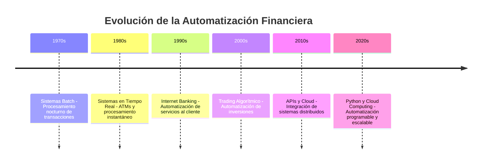
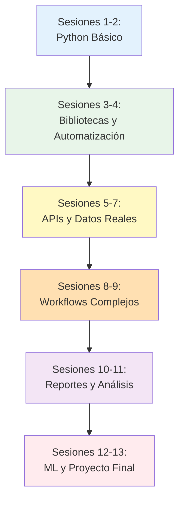

# Automatización de Procesos Financieros con Python
## Universidad Internacional de Valencia

!!! quote "Visión del Curso"
    *"La automatización no es el futuro de las finanzas, es su presente. Quien domina Python para automatizar workflows domina la eficiencia operativa del sector financiero."*

## Contexto histórico de la automatización financiera

La automatización en el sector financiero ha experimentado una transformación radical en las últimas décadas. Desde los primeros sistemas batch de los años 70 hasta las arquitecturas basadas en IA actuales, la evolución ha sido constante.



En la década actual, **Python** se ha consolidado como el lenguaje dominante en finanzas, permitiendo a profesionales crear automatizaciones complejas, análisis de datos sofisticados y sistemas de trading algorítmico. **Google Colab** proporciona un entorno gratuito y potente para ejecutar código Python sin necesidad de configuración local.

## Objetivos del curso

Este curso te capacitará para diseñar, implementar y optimizar sistemas de automatización que transformarán los procesos operativos en entidades financieras.

**Competencias a desarrollar:**

### Competencias específicas

- **C04**: Desarrollar estrategias de inversión algorítmica basadas en aprendizaje autónomo
- **C05**: Aplicar técnicas de procesamiento de lenguaje natural (NLP) para el análisis de textos financieros
- **C10**: Adaptar modelos de redes neuronales a diferentes problemas financieros

### Habilidades técnicas

- **H07**: Capacidad para el aprendizaje autónomo y continuo
- **H08**: Habilidad para la integración de sistemas y herramientas
- **H09**: Capacidad para la optimización de procesos repetitivos

### Conocimientos clave

- **CC10**: Conocer principios básicos de integración de APIs
- **CC11**: Comprender el diseño de workflows automatizados
- **CC12**: Manejar herramientas de automatización

## Estructura del curso

El curso está organizado en **13 sesiones** distribuidas en **5 bloques temáticos**:

### Bloque 1: Fundamentos de Python y automatización (4 sesiones)

Introducción a Python, Google Colab y bibliotecas esenciales para automatización financiera.

- **Sesión 1**: Introducción a la Automatización Financiera con Python
- **Sesión 2**: Fundamentos de Python y Google Colab
- **Sesión 3**: Bibliotecas Python para Finanzas
- **Sesión 4**: Automatización de Tareas con Python

### Bloque 2: Integración con APIs financieras (3 sesiones)

Consumo de APIs REST, manejo de datos financieros y autenticación.

- **Sesión 5**: Fundamentos de APIs REST con Python
- **Sesión 6**: APIs Financieras y Extracción de Datos
- **Sesión 7**: Autenticación, Seguridad y Manejo de Errores

### Bloque 3: Diseño de workflows automatizados (2 sesiones)

Arquitectura de scripts, scheduling y orquestación de procesos.

- **Sesión 8**: Arquitectura de Scripts y Workflows
- **Sesión 9**: Workflows Financieros Avanzados

### Bloque 4: Automatización de reportes y análisis (2 sesiones)

Generación automática de informes, visualizaciones y análisis de datos.

- **Sesión 10**: Automatización de Reportes con pandas y matplotlib
- **Sesión 11**: Análisis Automatizado de Datos Financieros

### Bloque 5: Aplicaciones avanzadas (2 sesiones)

Integración de Machine Learning y proyecto integrador.

- **Sesión 12**: IA y Machine Learning en Automatización Financiera
- **Sesión 13**: Proyecto Integrador Final

## Metodología

El curso combina:

- **Sesiones teórico-prácticas**: Explicación de conceptos con coding en vivo
- **Laboratorios hands-on**: Ejercicios prácticos en Google Colab con código Python real
- **Proyectos incrementales**: Construcción progresiva de scripts de automatización
- **Casos de uso reales**: Implementación de soluciones financieras del mundo real

## Herramientas y tecnologías

### Plataforma principal

- **Google Colab**: Entorno de notebooks Jupyter en la nube, gratuito y sin configuración
- **Python 3.10+**: Lenguaje de programación principal

### Bibliotecas Python clave

```python
# Manipulación de datos
import pandas as pd
import numpy as np

# APIs y peticiones HTTP
import requests
import json

# Visualización
import matplotlib.pyplot as plt
import seaborn as sns
import plotly.express as px

# Análisis financiero
import yfinance as yf
import pandas_datareader as pdr

# Automatización y scheduling
import schedule
import time
from datetime import datetime, timedelta

# Machine Learning
from sklearn.preprocessing import StandardScaler
from sklearn.model_selection import train_test_split
import tensorflow as tf
```

### APIs financieras que integraremos

- **Alpha Vantage**: Datos de mercado bursátil
- **Yahoo Finance API**: Cotizaciones y datos históricos
- **CoinGecko**: Criptomonedas
- **OpenExchangeRates**: Tipos de cambio
- **Plaid**: Datos bancarios (demo)

## Requisitos previos

### Conocimientos necesarios

- ✅ Conocimientos básicos de finanzas
- ✅ Conceptos de programación (variables, funciones, condicionales)
- ✅ Familiaridad con Excel y manipulación de datos

### Conocimientos deseables (no obligatorios)

- Python básico
- APIs REST
- JSON y estructuras de datos

### Recursos técnicos

- Cuenta de Google (para Google Colab)
- Navegador web moderno
- Conexión a internet estable

!!! tip "¡No necesitas instalar nada!"
    Google Colab funciona 100% en la nube. No requiere instalación local de Python ni bibliotecas.

## Evaluación

!!! info "Sistema de Evaluación"
    - **Ejercicios prácticos en Colab**: 30%
    - **Mini-proyectos semanales**: 30%
    - **Proyecto final integrador**: 40%
    
    Es requisito indispensable aprobar cada apartado con un mínimo de 5 para ponderar las calificaciones.

## Progresión del aprendizaje



## Recursos adicionales

- [Documentación oficial de Python](https://docs.python.org/3/)
- [Google Colab Notebooks](https://colab.research.google.com/)
- [pandas Documentation](https://pandas.pydata.org/docs/)
- [Requests: HTTP for Humans](https://requests.readthedocs.io/)
- [yfinance Library](https://pypi.org/project/yfinance/)
- Repositorio GitHub del curso con notebooks completos

---

!!! success "Bienvenida"
    ¡Bienvenido/a al curso de Automatización de Procesos Financieros con Python! Estás a punto de adquirir habilidades de programación que transformarán tu forma de trabajar en el sector financiero. Python es el lenguaje del futuro financiero.

