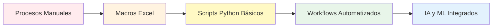
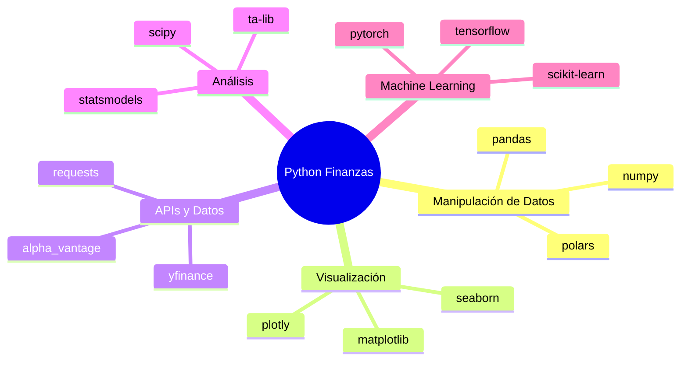
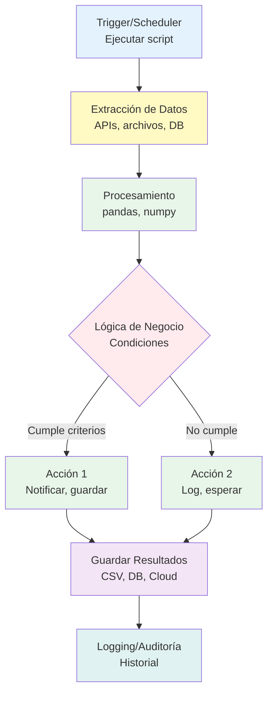

# Sesión 1: Introducción a la Automatización Financiera con Python

## Objetivos de aprendizaje

Al finalizar esta sesión, serás capaz de:

- Comprender los fundamentos de la automatización de procesos con Python
- Identificar oportunidades de automatización en el sector financiero
- Conocer el ecosistema Python para finanzas
- Escribir tu primer script de automatización financiera
- Evaluar el ROI de proyectos de automatización

## ¿Qué es la automatización de procesos?

La **automatización de procesos** consiste en utilizar tecnología (en nuestro caso, **Python**) para ejecutar tareas repetitivas o reglas de negocio sin intervención humana, mejorando la eficiencia, reduciendo errores y liberando tiempo para actividades de mayor valor.

!!! quote "Definición Clave"
    **Automatización de Procesos Financieros con Python**: Implementación de scripts y programas que ejecutan tareas financieras de forma autónoma, desde la extracción de datos de mercado hasta el análisis de riesgo crediticio.

### Evolución de la automatización



## Beneficios de la automatización financiera

### Beneficios cuantitativos

| Métrica | Mejora Promedio |
|---------|----------------|
| Reducción de tiempo en procesos | 70-90% |
| Disminución de errores manuales | 85-95% |
| Ahorro de costos operativos | 30-50% |
| Mejora en cumplimiento normativo | 60-80% |
| Incremento en productividad del equipo | 40-60% |

### Beneficios cualitativos

- **Consistencia**: Ejecución uniforme de procesos
- **Escalabilidad**: Capacidad para manejar volúmenes crecientes
- **Auditoría**: Trazabilidad completa de operaciones
- **Disponibilidad 24/7**: Operaciones continuas sin supervisión
- **Satisfacción del cliente**: Respuestas más rápidas y precisas

## Tipos de automatización en finanzas

### 1. Automatización de back office

Procesos internos que no requieren interacción directa con clientes:

- Conciliación bancaria automática
- Procesamiento de facturas y pagos
- Generación de reportes regulatorios
- Gestión de inventarios de valores

!!! example "Caso de Uso: Conciliación Bancaria"
    **Antes**: Un analista dedica 4 horas diarias comparando transacciones entre sistemas bancarios.
    
    **Después**: Un workflow automático:
    1. Extrae datos de múltiples bancos via API
    2. Normaliza formatos diferentes
    3. Identifica discrepancias automáticamente
    4. Genera reporte de excepción
    5. Notifica solo casos que requieren atención humana
    
    **Resultado**: Reducción de 4 horas a 15 minutos de revisión.

### 2. Automatización de front office

Interacciones directas con clientes:

- Chatbots para consultas financieras
- Procesamiento automático de solicitudes de crédito
- Alertas personalizadas de movimientos
- Recomendaciones de inversión automatizadas

### 3. Automatización de middle office

Gestión de riesgos y cumplimiento:

- Monitoreo de riesgo en tiempo real
- Detección de fraude con ML
- Cumplimiento KYC/AML automatizado
- Validación de transacciones

### 4. Automatización analítica

Procesamiento y análisis de datos:

- Dashboards en tiempo real
- Predicción de tendencias de mercado
- Análisis de sentimiento en noticias financieras
- Optimización de portafolios

## ¿Por qué Python para automatización financiera?

Python se ha convertido en el lenguaje dominante en finanzas por varias razones:

### Ventajas de Python

✅ **Sintaxis clara y legible**: Código fácil de entender y mantener  
✅ **Bibliotecas especializadas**: pandas, numpy, yfinance, etc.  
✅ **Comunidad activa**: Millones de desarrolladores y recursos  
✅ **Gratuito y open source**: Sin costos de licencias  
✅ **Versatilidad**: Desde web scraping hasta machine learning  
✅ **Integración**: APIs, bases de datos, cloud services  

### Comparativa: Python vs Excel

| Aspecto | Excel | Python |
|---------|-------|--------|
| **Escalabilidad** | < 1M filas | Ilimitado |
| **Automatización** | Macros limitadas | Scripts completos |
| **Reproducibilidad** | Baja (manual) | Alta (código) |
| **Mantenimiento** | Difícil | Versionable |
| **Costo** | Licencia $ | Gratis |
| **Velocidad** | Lenta (grandes datos) | Rápida |
| **ML/IA** | No nativo | Ecosistema completo |

### El ecosistema Python financiero



## Tu primer script de automatización

Vamos a crear un script simple que obtiene el precio actual de una acción y envía una alerta.

### Ejemplo 1: Obtener precio de acciones

En una ejecución en local es importante descargar las librerias, a partir de tener instalado python podremos realizar el comando: 

```python
# Instalamos la biblioteca yfinance
!pip install yfinance
```


```python
import yfinance as yf
from datetime import datetime

# Función para obtener precio actual
def obtener_precio_accion(ticker):
    """
    Obtiene el precio actual de una acción
    
    Args:
        ticker (str): Símbolo de la acción (ej: 'AAPL')
    
    Returns:
        dict: Información del precio
    """
    accion = yf.Ticker(ticker)
    info = accion.info
    
    datos = {
        'simbolo': ticker,
        'precio_actual': info.get('currentPrice', 'N/A'),
        'apertura': info.get('open', 'N/A'),
        'maximo': info.get('dayHigh', 'N/A'),
        'minimo': info.get('dayLow', 'N/A'),
        'volumen': info.get('volume', 'N/A'),
        'timestamp': datetime.now().strftime('%Y-%m-%d %H:%M:%S')
    }
    
    return datos

# Usar la función
apple = obtener_precio_accion('AAPL')
print(f"Precio de {apple['simbolo']}: ${apple['precio_actual']}")
print(f"Rango del día: ${apple['minimo']} - ${apple['maximo']}")
print(f"Última actualización: {apple['timestamp']}")
```

**Salida esperada:**
```
Precio de AAPL: $178.45
Rango del día: $175.23 - $179.10
Última actualización: 2026-03-30 14:32:10
```

### Ejemplo 2: Monitoreo de múltiples acciones

```python
import pandas as pd

def monitorear_portafolio(tickers):
    """
    Monitorea múltiples acciones y crea un resumen
    
    Args:
        tickers (list): Lista de símbolos de acciones
    
    Returns:
        DataFrame: Tabla con información de todas las acciones
    """
    datos_portafolio = []
    
    for ticker in tickers:
        try:
            datos = obtener_precio_accion(ticker)
            datos_portafolio.append(datos)
        except Exception as e:
            print(f"Error obteniendo {ticker}: {e}")
    
    # Crear DataFrame
    df = pd.DataFrame(datos_portafolio)
    return df

# Monitorear un portafolio
mis_acciones = ['AAPL', 'GOOGL', 'MSFT', 'AMZN', 'META']
portafolio_df = monitorear_portafolio(mis_acciones)

print("\n📊 RESUMEN DEL PORTAFOLIO")
print("=" * 60)
print(portafolio_df[['simbolo', 'precio_actual', 'volumen']])

# Calcular estadísticas
print(f"\n📈 Precio promedio: ${portafolio_df['precio_actual'].mean():.2f}")
print(f"🔝 Más alto: {portafolio_df.loc[portafolio_df['precio_actual'].idxmax(), 'simbolo']}")
print(f"🔻 Más bajo: {portafolio_df.loc[portafolio_df['precio_actual'].idxmin(), 'simbolo']}")
```

### Ejemplo 3: Sistema de alertas simple

```python
def verificar_alerta_precio(ticker, precio_objetivo, tipo='mayor'):
    """
    Verifica si el precio de una acción cumple con un objetivo
    
    Args:
        ticker (str): Símbolo de la acción
        precio_objetivo (float): Precio de referencia
        tipo (str): 'mayor' o 'menor'
    
    Returns:
        dict: Estado de la alerta
    """
    datos = obtener_precio_accion(ticker)
    precio_actual = datos['precio_actual']
    
    if tipo == 'mayor':
        alerta = precio_actual > precio_objetivo
        mensaje = f" {ticker} superó ${precio_objetivo}! Precio actual: ${precio_actual}"
    else:
        alerta = precio_actual < precio_objetivo
        mensaje = f" {ticker} bajó de ${precio_objetivo}! Precio actual: ${precio_actual}"
    
    return {
        'alerta_activada': alerta,
        'mensaje': mensaje if alerta else f" {ticker} en rango normal: ${precio_actual}",
        'datos': datos
    }

# Configurar alertas
resultado = verificar_alerta_precio('AAPL', 180, 'mayor')
print(resultado['mensaje'])

resultado = verificar_alerta_precio('TSLA', 200, 'menor')
print(resultado['mensaje'])
```

## Marco de decisión para automatizar

No todo proceso debe automatizarse. Usa este framework:

### Criterios de evaluación

**ROI = (Ahorro de Tiempo × Costo/Hora) - Costo de Implementación**

Evalúa cada proceso con la matriz RICE:

- **Reach**: ¿Cuántas personas/transacciones afecta?
- **Impact**: ¿Qué tan grande es el impacto?
- **Confidence**: ¿Qué tan seguros estamos del éxito?
- **Effort**: ¿Cuánto esfuerzo requiere?

**Puntuación RICE = (Reach × Impact × Confidence) / Effort**

!!! tip "Regla de Oro"
    Prioriza procesos que sean:
    
    - **Repetitivos**: Se ejecutan frecuentemente
    - **Basados en reglas**: Lógica clara y definida
    - **Alto volumen**: Muchas transacciones
    - **Propensos a error**: Intervención humana genera errores
    - **Consumidores de tiempo**: Ciclos largos de ejecución

## Arquitectura básica de automatización en Python

### Componentes fundamentales



### Tipos de triggers (disparadores)

#### 1. **Programación temporal** (Scheduling)

```python
import schedule # hace falta instalación previa
import time

def tarea_diaria():
    """Ejecutar cada día a las 9:00 AM"""
    print("Ejecutando análisis diario...")
    portafolio = monitorear_portafolio(['AAPL', 'GOOGL', 'MSFT'])
    # Guardar resultados, enviar reporte, etc.

# Programar tarea
schedule.every().day.at("09:00").do(tarea_diaria)
schedule.every().monday.at("08:00").do(tarea_semanal)

# Mantener el script ejecutándose
while True:
    schedule.run_pending()
    time.sleep(60)  # Revisar cada minuto
```

#### 2. **Eventos basados en condiciones**

```python
def monitorear_continuamente(ticker, precio_objetivo):
    """Monitorear precio hasta que se alcance objetivo"""
    while True:
        resultado = verificar_alerta_precio(ticker, precio_objetivo, 'mayor')
        
        if resultado['alerta_activada']:
            print(resultado['mensaje'])
            enviar_notificacion(resultado['mensaje'])
            break  # Detener monitoreo
        
        time.sleep(300)  # Revisar cada 5 minutos
```

#### 3. **Manual/On-demand**

```python
# Ejecutar cuando sea necesario
if __name__ == "__main__":
    ticker = input("Ingrese símbolo de acción: ")
    datos = obtener_precio_accion(ticker)
    print(f"Precio: ${datos['precio_actual']}")
```

## Ejemplo completo: Automatización de reporte diario

```python
"""
Script de automatización: Reporte Diario de Portafolio
Ejecuta cada día y genera un reporte con el estado de las inversiones
"""

import yfinance as yf
import pandas as pd
import matplotlib.pyplot as plt
from datetime import datetime, timedelta
import smtplib
from email.mime.text import MIMEText
from email.mime.multipart import MIMEMultipart

class AnalizadorPortafolio:
    """Clase para analizar y reportar portafolio de acciones"""
    
    def __init__(self, tickers, cantidades):
        """
        Inicializar analizador
        
        Args:
            tickers (list): Lista de símbolos ['AAPL', 'GOOGL', etc.]
            cantidades (list): Número de acciones de cada una [10, 5, etc.]
        """
        self.tickers = tickers
        self.cantidades = cantidades
        self.datos = None
    
    def obtener_datos(self, periodo='1mo'):
        """Obtener datos históricos de todas las acciones"""
        datos_lista = []
        
        for ticker, cantidad in zip(self.tickers, self.cantidades):
            accion = yf.Ticker(ticker)
            hist = accion.history(period=periodo)
            info = accion.info
            
            precio_actual = hist['Close'].iloc[-1]
            precio_anterior = hist['Close'].iloc[-2]
            cambio_diario = ((precio_actual - precio_anterior) / precio_anterior) * 100
            
            datos_lista.append({
                'Ticker': ticker,
                'Cantidad': cantidad,
                'Precio': precio_actual,
                'Valor Total': precio_actual * cantidad,
                'Cambio %': cambio_diario,
                'Ganancia/Pérdida $': (precio_actual - precio_anterior) * cantidad
            })
        
        self.datos = pd.DataFrame(datos_lista)
        return self.datos
    
    def generar_resumen(self):
        """Generar resumen estadístico del portafolio"""
        valor_total = self.datos['Valor Total'].sum()
        cambio_total = self.datos['Ganancia/Pérdida $'].sum()
        cambio_porcentaje = (cambio_total / (valor_total - cambio_total)) * 100
        
        resumen = f"""
📊 REPORTE DIARIO DE PORTAFOLIO - {datetime.now().strftime('%Y-%m-%d')}
{'=' * 60}

💰 Valor Total del Portafolio: ${valor_total:,.2f}
📈 Cambio del Día: ${cambio_total:,.2f} ({cambio_porcentaje:+.2f}%)

{'MEJOR RENDIMIENTO' if cambio_total > 0 else 'PEOR RENDIMIENTO'} DEL DÍA:
{self.datos.nlargest(1, 'Cambio %')[['Ticker', 'Cambio %', 'Ganancia/Pérdida $']].to_string(index=False)}

DESGLOSE POR ACCIÓN:
{self.datos.to_string(index=False)}
        """
        return resumen
    
    def crear_grafico(self, filename='portafolio.png'):
        """Crear gráfico visual del portafolio"""
        fig, (ax1, ax2) = plt.subplots(1, 2, figsize=(14, 6))
        
        # Gráfico de distribución de valor
        ax1.pie(self.datos['Valor Total'], labels=self.datos['Ticker'], 
                autopct='%1.1f%%', startangle=90)
        ax1.set_title('Distribución del Portafolio')
        
        # Gráfico de rendimiento diario
        colors = ['green' if x > 0 else 'red' for x in self.datos['Cambio %']]
        ax2.barh(self.datos['Ticker'], self.datos['Cambio %'], color=colors)
        ax2.set_xlabel('Cambio %')
        ax2.set_title('Rendimiento Diario')
        ax2.axvline(x=0, color='black', linestyle='-', linewidth=0.5)
        
        plt.tight_layout()
        plt.savefig(filename, dpi=300, bbox_inches='tight')
        plt.close()
        
        return filename
    
    def guardar_historial(self, filename='historial_portafolio.csv'):
        """Guardar datos en CSV para análisis histórico"""
        self.datos['Fecha'] = datetime.now().strftime('%Y-%m-%d')
        
        # Append to CSV (crear si no existe)
        try:
            df_existente = pd.read_csv(filename)
            df_nuevo = pd.concat([df_existente, self.datos], ignore_index=True)
            df_nuevo.to_csv(filename, index=False)
        except FileNotFoundError:
            self.datos.to_csv(filename, index=False)
        
        print(f"✅ Historial guardado en {filename}")

# EJECUTAR EL SCRIPT
if __name__ == "__main__":
    # Definir portafolio
    mis_tickers = ['AAPL', 'GOOGL', 'MSFT', 'AMZN', 'TSLA']
    mis_cantidades = [50, 20, 30, 15, 25]
    
    # Crear analizador
    analizador = AnalizadorPortafolio(mis_tickers, mis_cantidades)
    
    # Obtener datos actuales
    print("🔄 Obteniendo datos del mercado...")
    analizador.obtener_datos()
    
    # Generar y mostrar resumen
    resumen = analizador.generar_resumen()
    print(resumen)
    
    # Crear visualización
    print("\n📊 Generando gráficos...")
    archivo_grafico = analizador.crear_grafico()
    print(f"✅ Gráfico guardado: {archivo_grafico}")
    
    # Guardar historial
    analizador.guardar_historial()
    
    print("\n✅ Reporte completado exitosamente!")
```

**Salida del script:**

```
🔄 Obteniendo datos del mercado...

📊 REPORTE DIARIO DE PORTAFOLIO - 2026-03-30
============================================================

💰 Valor Total del Portafolio: $47,325.50
📈 Cambio del Día: $+1,247.30 (+2.71%)

MEJOR RENDIMIENTO DEL DÍA:
Ticker  Cambio %  Ganancia/Pérdida $
 TSLA      3.45              862.50

DESGLOSE POR ACCIÓN:
Ticker  Cantidad   Precio  Valor Total  Cambio %  Ganancia/Pérdida $
 AAPL        50   178.45      8922.50      2.15              187.35
GOOGL        20   145.23      2904.60      1.87               53.12
 MSFT        30   420.18     12605.40      2.34              288.15
 AMZN        15   182.92      2743.80     -0.45              -12.37
 TSLA        25  1000.08     25002.00      3.45              862.50

📊 Generando gráficos...
✅ Gráfico guardado: portafolio.png
✅ Historial guardado en historial_portafolio.csv

✅ Reporte completado exitosamente!
```

## Mejores prácticas en automatización con Python

### 1. Estructura tu código con funciones y clases

❌ **Error común**: Todo el código en un solo script gigante

```python
# Mal: código desorganizado
import yfinance as yf
aapl = yf.Ticker('AAPL')
precio = aapl.info['currentPrice']
print(precio)
googl = yf.Ticker('GOOGL')
precio2 = googl.info['currentPrice']
print(precio2)
# ... repitiendo código
```

✅ **Mejor enfoque**: Funciones reutilizables

```python
# Bien: código modular
def obtener_precio(ticker):
    """Obtiene precio de una acción de forma reutilizable"""
    accion = yf.Ticker(ticker)
    return accion.info.get('currentPrice', 0)

# Usar función
for ticker in ['AAPL', 'GOOGL', 'MSFT']:
    print(f"{ticker}: ${obtener_precio(ticker)}")
```

### 2. Manejo robusto de errores

```python
def obtener_precio_seguro(ticker):
    """
    Obtiene precio con manejo de errores
    """
    try:
        accion = yf.Ticker(ticker)
        precio = accion.info.get('currentPrice')
        
        if precio is None or precio == 0:
            raise ValueError(f"Precio no disponible para {ticker}")
        
        return precio
        
    except Exception as e:
        print(f"⚠️ Error obteniendo {ticker}: {e}")
        return None

# Usar con validación
precio = obtener_precio_seguro('AAPL')
if precio:
    print(f"Precio: ${precio}")
else:
    print("No se pudo obtener el precio")
```

### 3. Logging para auditoría

```python
import logging
from datetime import datetime

# Configurar logging
logging.basicConfig(
    filename=f'automatizacion_{datetime.now().strftime("%Y%m%d")}.log',
    level=logging.INFO,
    format='%(asctime)s - %(levelname)s - %(message)s'
)

def procesar_con_log(ticker):
    """Procesar con registro de actividad"""
    logging.info(f"Iniciando procesamiento de {ticker}")
    
    try:
        precio = obtener_precio(ticker)
        logging.info(f"Precio obtenido para {ticker}: ${precio}")
        return precio
    except Exception as e:
        logging.error(f"Error procesando {ticker}: {e}")
        return None
```

### 4. Variables de configuración

```python
# config.py
CONFIG = {
    'TICKERS': ['AAPL', 'GOOGL', 'MSFT', 'AMZN', 'TSLA'],
    'REFRESH_INTERVAL': 300,  # segundos
    'ALERTA_EMAIL': 'tu_email@example.com',
    'PRECIO_ALERTA': {
        'AAPL': 180,
        'TSLA': 250
    }
}

# main.py
from config import CONFIG

for ticker in CONFIG['TICKERS']:
    precio = obtener_precio(ticker)
    # procesar...
```

### 5. Testing básico

```python
def test_obtener_precio():
    """Test simple de función"""
    precio = obtener_precio('AAPL')
    assert precio > 0, "El precio debe ser positivo"
    assert isinstance(precio, (int, float)), "El precio debe ser un número"
    print("✅ Test pasado")

# Ejecutar test
test_obtener_precio()
```

##  Ventajas para automatización financiera

```python
# En Colab puedes:

# 1. Instalar cualquier biblioteca
!pip install yfinance alpha_vantage pandas-ta

# 2. Guardar en Google Drive
from google.colab import drive
drive.mount('/content/drive')

# 3. Programar ejecuciones
# (o usar Google Cloud Scheduler + Colab)

# 4. Compartir notebooks fácilmente
# File → Share → Generar link
```


## Ejercicio práctico

### Ejercicio 1: Tu primer script de automatización

Crea un notebook en Google Colab que:

1. Importe las bibliotecas necesarias (`yfinance`, `pandas`)
2. Defina una lista con 5 acciones de tu interés
3. Obtenga el precio actual de cada una
4. Calcule el precio promedio
5. Identifique la acción más cara y más barata
6. Muestre los resultados en formato tabla

**Plantilla de inicio:**

```python
# 1. Instalar bibliotecas
!pip install yfinance pandas

# 2. Importar
import yfinance as yf
import pandas as pd

# 3. Tu código aquí...
mis_acciones = ['AAPL', 'GOOGL', 'MSFT', 'TSLA', 'NVDA']

# ... completar
```

### Ejercicio 2: Sistema de alertas básico

Implementa una función que:

- Reciba un ticker y un precio objetivo
- Verifique si el precio actual supera ese objetivo
- Retorne un mensaje indicando si se activó la alerta

```python
def verificar_alerta(ticker, precio_objetivo):
    # Tu código aquí
    pass

# Probar
resultado = verificar_alerta('AAPL', 180)
print(resultado)
```

### Ejercicio 3: Análisis de portafolio

Usando la clase `AnalizadorPortafolio` del ejemplo, modifica el código para:

1. Agregar 2 acciones adicionales a tu portafolio
2. Calcular el porcentaje que representa cada acción del total
3. Identificar si tu portafolio ganó o perdió en el día

## Glosario de términos

- **Script**: Programa Python que automatiza tareas
- **Biblioteca (Library)**: Conjunto de funciones reutilizables (ej: pandas)
- **API**: Interfaz para obtener datos de servicios externos
- **DataFrame**: Estructura de datos tabular de pandas
- **Ticker**: Símbolo que identifica una acción (ej: 'AAPL' para Apple)
- **Jupyter Notebook**: Entorno interactivo para código Python
- **Google Colab**: Jupyter Notebook en la nube de Google
- **Scheduling**: Programación de tareas automáticas
- **Logging**: Registro de actividades del programa

## Recursos adicionales

### Documentación oficial

- [Python Official Docs](https://docs.python.org/3/)
- [pandas Documentation](https://pandas.pydata.org/)
- [yfinance on PyPI](https://pypi.org/project/yfinance/)
- [Google Colab Guide](https://colab.research.google.com/notebooks/intro.ipynb)

### Tutoriales recomendados

- [Python for Finance - Real Python](https://realpython.com/python-finance/)
- [Automate the Boring Stuff with Python](https://automatetheboringstuff.com/)
- [pandas for Financial Data Analysis](https://pandas.pydata.org/docs/getting_started/intro_tutorials/index.html)

### Comunidades

- [r/algotrading](https://reddit.com/r/algotrading)
- [Python Financial Analysis Discord]
- Stack Overflow - Tag: [python-finance]

## Resumen

En esta sesión hemos cubierto:

✅ Fundamentos de automatización de procesos con Python  
✅ Ventajas de Python sobre Excel y otras herramientas  
✅ El ecosistema Python para finanzas  
✅ Tu primer script de automatización (obtener precios)  
✅ Ejemplo completo: Analizador de portafolio  
✅ Mejores prácticas de programación  
✅ Introducción a Google Colab  

**Próxima sesión**: Profundizaremos en **fundamentos de Python**, estructuras de datos, preparándote para automatizaciones más avanzadas.

---

!!! tip "Tarea para la Próxima Sesión"
    1. ✅ Crea tu primer notebook y ejecuta el código de ejemplo
    2. ✅ Completa los 3 ejercicios prácticos
    3. ✅ Investiga 3 bibliotecas Python financieras que te interesen
    4. ✅ Identifica un proceso manual en tu trabajo que podrías automatizar con Python

