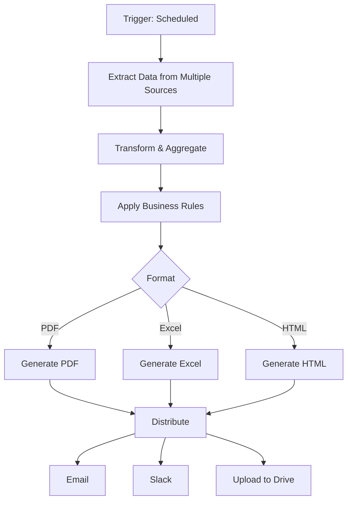

# Sesión 10: Automatización de Reportes

## Objetivos

- Generar reportes automáticos
- Crear dashboards dinámicos
- Automatizar distribución de reportes
- Personalizar visualizaciones

## Tipos de reportes financieros

### 1. Reportes operativos (diarios)

- Transacciones del día
- Cash position
- Conciliación bancaria
- Alertas de anomalías

### 2. Reportes gerenciales (semanales/mensuales)

- P&L statement
- Balance sheet
- Cash flow
- KPIs financieros

### 3. Reportes regulatorios

- FINRA reports
- Tax filings (1099, etc.)
- AML/KYC reports
- Audit trails

## Generación automática de reportes

### Workflow básico



### Extracción de datos

```javascript
// Obtener datos de múltiples fuentes
async function extractFinancialData(startDate, endDate) {
  const [
    stripeData,
    plaidData,
    quickbooksData
  ] = await Promise.all([
    getStripeTransactions(startDate, endDate),
    getPlaidTransactions(startDate, endDate),
    getQuickBooksData(startDate, endDate)
  ]);
  
  return {
    payments: stripeData,
    banking: plaidData,
    accounting: quickbooksData
  };
}
```

### Transformación y agregación

```javascript
function generateMonthlyReport(data) {
  const revenue = data.payments.reduce((sum, p) => sum + p.amount, 0);
  const expenses = data.banking.filter(t => t.amount < 0)
    .reduce((sum, t) => sum + Math.abs(t.amount), 0);
  
  const profit = revenue - expenses;
  const margin = (profit / revenue) * 100;
  
  // Group by category
  const expensesByCategory = data.banking
    .filter(t => t.amount < 0)
    .reduce((acc, t) => {
      const cat = t.category || 'Other';
      acc[cat] = (acc[cat] || 0) + Math.abs(t.amount);
      return acc;
    }, {});
  
  return {
    period: { start: startDate, end: endDate },
    summary: {
      revenue: revenue / 100,
      expenses: expenses / 100,
      profit: profit / 100,
      margin: margin.toFixed(2) + '%'
    },
    expenses_by_category: expensesByCategory,
    top_transactions: data.payments.sort((a, b) => b.amount - a.amount).slice(0, 10)
  };
}
```

## Generación de PDFs

### Usando Puppeteer

```javascript
const puppeteer = require('puppeteer');

async function generatePDFReport(data) {
  const html = generateHTMLReport(data);
  
  const browser = await puppeteer.launch();
  const page = await browser.newPage();
  
  await page.setContent(html);
  
  const pdf = await page.pdf({
    format: 'A4',
    margin: { top: '20mm', right: '15mm', bottom: '20mm', left: '15mm' },
    printBackground: true
  });
  
  await browser.close();
  
  return pdf;
}

function generateHTMLReport(data) {
  return `
<!DOCTYPE html>
<html>
<head>
    <style>
        body { font-family: Arial, sans-serif; }
        .header { background: #3f51b5; color: white; padding: 20px; }
        table { width: 100%; border-collapse: collapse; margin: 20px 0; }
        th, td { border: 1px solid #ddd; padding: 12px; text-align: left; }
        th { background-color: #f2f2f2; }
        .positive { color: green; }
        .negative { color: red; }
    </style>
</head>
<body>
    <div class="header">
        <h1>Monthly Financial Report</h1>
        <p>${data.period.start} - ${data.period.end}</p>
    </div>
    
    <h2>Financial Summary</h2>
    <table>
        <tr>
            <th>Metric</th>
            <th>Amount</th>
        </tr>
        <tr>
            <td>Revenue</td>
            <td class="positive">$${data.summary.revenue.toLocaleString()}</td>
        </tr>
        <tr>
            <td>Expenses</td>
            <td class="negative">$${data.summary.expenses.toLocaleString()}</td>
        </tr>
        <tr>
            <td><strong>Net Profit</strong></td>
            <td class="${data.summary.profit > 0 ? 'positive' : 'negative'}">
                <strong>$${data.summary.profit.toLocaleString()}</strong>
            </td>
        </tr>
        <tr>
            <td>Profit Margin</td>
            <td>${data.summary.margin}</td>
        </tr>
    </table>
    
    <h2>Expenses by Category</h2>
    <table>
        ${Object.entries(data.expenses_by_category)
          .map(([cat, amount]) => `
            <tr>
                <td>${cat}</td>
                <td>$${(amount/100).toLocaleString()}</td>
            </tr>
          `).join('')}
    </table>
</body>
</html>
  `;
}
```

### Usando Google Docs API

```javascript
async function createGoogleDocReport(data) {
  const docs = google.docs({ version: 'v1', auth });
  
  // Create document
  const createResponse = await docs.documents.create({
    requestBody: {
      title: `Financial Report - ${new Date().toISOString().split('T')[0]}`
    }
  });
  
  const documentId = createResponse.data.documentId;
  
  // Insert content
  await docs.documents.batchUpdate({
    documentId,
    requestBody: {
      requests: [
        {
          insertText: {
            location: { index: 1 },
            text: `Financial Report\n\nRevenue: $${data.summary.revenue}\nExpenses: $${data.summary.expenses}\nProfit: $${data.summary.profit}\n`
          }
        }
      ]
    }
  });
  
  return documentId;
}
```

## Generación de Excel

### Usando ExcelJS

```javascript
const ExcelJS = require('exceljs');

async function generateExcelReport(data) {
  const workbook = new ExcelJS.Workbook();
  
  // Summary Sheet
  const summarySheet = workbook.addWorksheet('Summary');
  summarySheet.columns = [
    { header: 'Metric', key: 'metric', width: 20 },
    { header: 'Value', key: 'value', width: 15 }
  ];
  
  summarySheet.addRows([
    { metric: 'Revenue', value: data.summary.revenue },
    { metric: 'Expenses', value: data.summary.expenses },
    { metric: 'Profit', value: data.summary.profit },
    { metric: 'Margin', value: data.summary.margin }
  ]);
  
  // Style header
  summarySheet.getRow(1).font = { bold: true };
  summarySheet.getRow(1).fill = {
    type: 'pattern',
    pattern: 'solid',
    fgColor: { argb: 'FF3F51B5' }
  };
  
  // Transactions Sheet
  const transactionsSheet = workbook.addWorksheet('Transactions');
  transactionsSheet.columns = [
    { header: 'Date', key: 'date', width: 12 },
    { header: 'Description', key: 'description', width: 30 },
    { header: 'Amount', key: 'amount', width: 12 }
  ];
  
  data.top_transactions.forEach(tx => {
    transactionsSheet.addRow({
      date: new Date(tx.created * 1000).toLocaleDateString(),
      description: tx.description,
      amount: tx.amount / 100
    });
  });
  
  // Save
  const buffer = await workbook.xlsx.writeBuffer();
  return buffer;
}
```

## Dashboards automáticos

### Google Data Studio / Looker Studio

```javascript
// Workflow para actualizar datos de dashboard
async function updateDashboardData() {
  const data = await extractFinancialData(startDate, endDate);
  
  // Update Google Sheet (data source for dashboard)
  await googleSheets.spreadsheets.values.update({
    spreadsheetId: DASHBOARD_SHEET_ID,
    range: 'Data!A1',
    valueInputOption: 'RAW',
    requestBody: {
      values: [
        ['Date', 'Revenue', 'Expenses', 'Profit'],
        ...data.daily.map(d => [
          d.date,
          d.revenue,
          d.expenses,
          d.profit
        ])
      ]
    }
  });
  
  // Dashboard se actualiza automáticamente
}
```

### Metabase automated reports

```javascript
// Trigger Metabase question/dashboard via API
async function triggerMetabaseReport(dashboardId) {
  const response = await fetch(
    `https://metabase.company.com/api/dashboard/${dashboardId}`,
    {
      headers: {
        'X-API-KEY': process.env.METABASE_API_KEY
      }
    }
  );
  
  // Metabase can email results automatically
  const emailResponse = await fetch(
    `https://metabase.company.com/api/pulse`,
    {
      method: 'POST',
      headers: {
        'X-API-KEY': process.env.METABASE_API_KEY,
        'Content-Type': 'application/json'
      },
      body: JSON.stringify({
        name: 'Monthly Financial Report',
        cards: [{ id: dashboardId }],
        channels: [{
          channel_type: 'email',
          recipients: ['finance-team@company.com'],
          enabled: true
        }],
        skip_if_empty: true
      })
    }
  );
}
```

## Distribución de reportes

### Email con attachments

```javascript
// Usando Gmail API
async function emailReport(pdfBuffer, recipients) {
  const gmail = google.gmail({ version: 'v1', auth });
  
  const message = [
    'From: "Finance Team" <finance@company.com>',
    `To: ${recipients.join(', ')}`,
    'Subject: Monthly Financial Report',
    'MIME-Version: 1.0',
    'Content-Type: multipart/mixed; boundary="boundary"',
    '',
    '--boundary',
    'Content-Type: text/html; charset="UTF-8"',
    '',
    '<h2>Monthly Financial Report</h2>',
    '<p>Please find attached the monthly financial report.</p>',
    '',
    '--boundary',
    'Content-Type: application/pdf',
    'Content-Disposition: attachment; filename="report.pdf"',
    'Content-Transfer-Encoding: base64',
    '',
    pdfBuffer.toString('base64'),
    '--boundary--'
  ].join('\r\n');
  
  const encodedMessage = Buffer.from(message)
    .toString('base64')
    .replace(/\+/g, '-')
    .replace(/\//g, '_')
    .replace(/=+$/, '');
  
  await gmail.users.messages.send({
    userId: 'me',
    requestBody: {
      raw: encodedMessage
    }
  });
}
```

### Slack con gráficos

```javascript
async function postReportToSlack(data) {
  // Generate chart image
  const chartUrl = await generateChartImage(data);
  
  await slack.chat.postMessage({
    channel: '#finance-reports',
    text: 'Monthly Financial Report',
    blocks: [
      {
        type: 'header',
        text: {
          type: 'plain_text',
          text: '📊 Monthly Financial Report'
        }
      },
      {
        type: 'section',
        fields: [
          {
            type: 'mrkdwn',
            text: `*Revenue:*\n$${data.summary.revenue.toLocaleString()}`
          },
          {
            type: 'mrkdwn',
            text: `*Expenses:*\n$${data.summary.expenses.toLocaleString()}`
          },
          {
            type: 'mrkdwn',
            text: `*Profit:*\n$${data.summary.profit.toLocaleString()}`
          },
          {
            type: 'mrkdwn',
            text: `*Margin:*\n${data.summary.margin}`
          }
        ]
      },
      {
        type: 'image',
        image_url: chartUrl,
        alt_text: 'Monthly trends chart'
      }
    ]
  });
}
```

## Ejercicio práctico

**Crear**: Sistema de reportes automatizado que:

1. Ejecuta cada lunes a las 9am
2. Obtiene datos de la semana pasada
3. Genera reporte PDF
4. Genera Excel con datos detallados
5. Envía por email a stakeholders
6. Publica resumen en Slack
7. Archiva en Google Drive

## Recursos

- [ExcelJS Documentation](https://github.com/exceljs/exceljs)
- [Puppeteer PDF Generation](https://pptr.dev/)
- [Google Docs API](https://developers.google.com/docs/api)

## Resumen

✅ Generación automática de reportes  
✅ PDFs y Excel programáticos  
✅ Dashboards automáticos  
✅ Distribución multicanal  

**Próxima sesión**: Análisis Automatizado de Datos
