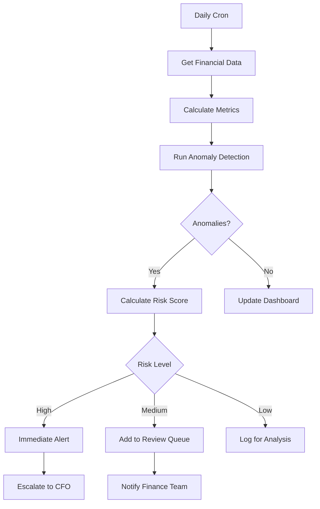

# Sesión 11: Análisis Automatizado de Datos

## Objetivos

- Implementar análisis de datos con Python en workflows
- Detectar anomalías automáticamente
- Generar insights con ML
- Automatizar forecasting financiero

## Python en workflows

### Integración Python con n8n

```python
# Execute Python Code Node en n8n
import pandas as pd
import numpy as np

# Recibir datos del nodo anterior
data = $input.all()
df = pd.DataFrame([item['json'] for item in data])

# Análisis
stats = {
    'mean': df['amount'].mean(),
    'median': df['amount'].median(),
    'std': df['amount'].std(),
    'total': df['amount'].sum()
}

return [{'json': stats}]
```

### Pandas para análisis financiero

```python
import pandas as pd
import numpy as np

# Load transaction data
df = pd.DataFrame(transactions)
df['date'] = pd.to_datetime(df['date'])
df.set_index('date', inplace=True)

# Calculate metrics
monthly_revenue = df[df['amount'] > 0].resample('M')['amount'].sum()
monthly_expenses = df[df['amount'] < 0].resample('M')['amount'].sum()

# Growth rate
revenue_growth = monthly_revenue.pct_change() * 100

# Moving averages
ma_7day = df['amount'].rolling(window=7).mean()
ma_30day = df['amount'].rolling(window=30).mean()

# Categorize transactions
df['category'] = df['description'].apply(categorize_transaction)
spending_by_category = df.groupby('category')['amount'].sum()

# Identify top vendors
top_vendors = df.groupby('vendor')['amount'].sum().sort_values(ascending=False).head(10)
```

## Detección de anomalías

### Z-Score Method

```python
from scipy import stats

def detect_anomalies_zscore(df, threshold=3):
    df['amount_zscore'] = stats.zscore(df['amount'])
    anomalies = df[np.abs(df['amount_zscore']) > threshold]
    
    return anomalies[['date', 'amount', 'description', 'amount_zscore']]

# Uso
anomalies = detect_anomalies_zscore(transactions_df)

if len(anomalies) > 0:
    send_alert(f"Detected {len(anomalies)} anomalous transactions")
```

### Isolation forest (ML)

```python
from sklearn.ensemble import IsolationForest

# Prepare features
X = df[['amount', 'hour', 'day_of_week']].values

# Train model
clf = IsolationForest(contamination=0.01, random_state=42)
predictions = clf.fit_predict(X)

# Add anomaly flag
df['anomaly'] = predictions
anomalies = df[df['anomaly'] == -1]

# Alert on anomalies
for idx, row in anomalies.iterrows():
    create_alert({
        'type': 'anomaly',
        'transaction_id': row['id'],
        'amount': row['amount'],
        'description': row['description'],
        'score': clf.score_samples(X[[idx]])[0]
    })
```

## Time series analysis

### Forecasting con Prophet

```python
from fbprophet import Prophet

# Prepare data
df_prophet = df.reset_index()[['date', 'amount']]
df_prophet.columns = ['ds', 'y']

# Train model
model = Prophet(
    yearly_seasonality=True,
    weekly_seasonality=True,
    daily_seasonality=False
)
model.fit(df_prophet)

# Make future predictions
future = model.make_future_dataframe(periods=30)  # 30 days ahead
forecast = model.predict(future)

# Extract predictions
predictions = forecast[['ds', 'yhat', 'yhat_lower', 'yhat_upper']].tail(30)

# Alert if predicted revenue below threshold
if predictions['yhat'].mean() < threshold:
    send_alert("Forecasted revenue below target")
```

### ARIMA for financial forecasting

```python
from statsmodels.tsa.arima.model import ARIMA

# Prepare data
ts_data = df['amount'].resample('D').sum()

# Fit ARIMA model
model = ARIMA(ts_data, order=(5,1,0))
model_fit = model.fit()

# Forecast next 7 days
forecast = model_fit.forecast(steps=7)

# Calculate confidence intervals
forecast_df = pd.DataFrame({
    'date': pd.date_range(start=ts_data.index[-1] + pd.Timedelta(days=1), periods=7),
    'forecast': forecast
})
```

## Sentiment analysis para finanzas

### Análisis de noticias

```python
from transformers import pipeline

# Load FinBERT model
sentiment_analyzer = pipeline("sentiment-analysis", model="ProsusAI/finbert")

# Analyze news
news_headlines = [
    "Apple reports record quarterly revenue",
    "Federal Reserve raises interest rates",
    "Tech stocks plunge amid recession fears"
]

sentiments = []
for headline in news_headlines:
    result = sentiment_analyzer(headline)[0]
    sentiments.append({
        'headline': headline
        'sentiment': result['label'],
        'score': result['score']
    })

# Calculate overall market sentiment
avg_sentiment = sum([s['score'] if s['sentiment'] == 'positive' else -s['score'] for s in sentiments]) / len(sentiments)

if avg_sentiment < -0.3:
    send_alert("Negative market sentiment detected")
```

## Risk scoring automatizado

### Credit risk model

```python
def calculate_credit_score(customer_data):
    score = 300  # Base score
    
    # Payment history (35%)
    on_time_rate = customer_data['on_time_payments'] / customer_data['total_payments']
    score += int(on_time_rate * 250)
    
    # Credit utilization (30%)
    utilization = customer_data['credit_used'] / customer_data['credit_limit']
    if utilization < 0.3:
        score += 210
    elif utilization < 0.5:
        score += 150
    else:
        score += 50
    
    # Length of history (15%)
    months = customer_data['account_age_months']
    score += min(int(months / 2), 105)
    
    # Credit mix (10%)
    score += min(customer_data['account_types'] * 25, 70)
    
    # New credit (10%)
    recent_inquiries = customer_data['inquiries_last_6months']
    score += max(70 - (recent_inquiries * 10), 0)
    
    # Cap at 850
    score = min(score, 850)
    
    # Assign rating
    if score >= 800:
        rating = 'Excellent'
    elif score >= 740:
        rating = 'Very Good'
    elif score >= 670:
        rating = 'Good'
    elif score >= 580:
        rating = 'Fair'
    else:
        rating = 'Poor'
    
    return {
        'score': score,
        'rating': rating,
        'recommended_action': get_action_from_score(score)
    }
```

## Clustering de clientes

```python
from sklearn.cluster import KMeans
from sklearn.preprocessing import StandardScaler

# Prepare customer features
customer_features = df.groupby('customer_id').agg({
    'amount': ['sum', 'mean', 'std', 'count'],
    'days_since_last_purchase': 'min'
}).reset_index()

# Normalize
scaler = StandardScaler()
X_scaled = scaler.fit_transform(customer_features.iloc[:, 1:])

# Cluster
kmeans = KMeans(n_clusters=4, random_state=42)
customer_features['cluster'] = kmeans.fit_predict(X_scaled)

# Analyze clusters
for cluster_id in range(4):
    cluster_customers = customer_features[customer_features['cluster'] == cluster_id]
    
    print(f"\nCluster {cluster_id}:")
    print(f"  Size: {len(cluster_customers)}")
    print(f"  Avg Spending: ${cluster_customers[('amount', 'mean')].mean():.2f}")
    print(f"  Avg Frequency: {cluster_customers[('amount', 'count')].mean():.1f} purchases")
    
# Assign cluster names
cluster_names = {
    0: 'High Value',
    1: 'Regular',
    2: 'Occasional',
    3: 'At Risk'
}

# Create targeted campaigns per cluster
```

## Caso práctico: sistema de early warning



### Implementación

```python
# Early Warning System
def assess_financial_health(company_data):
    warnings = []
    
    # Cash runway
    monthly_burn = company_data['expenses'] / 30
    days_of_cash = company_data['cash_balance'] / monthly_burn
    
    if days_of_cash < 30:
        warnings.append({
            'severity': 'CRITICAL',
            'metric': 'Cash Runway',
            'value': f'{days_of_cash:.0f} days',
            'message': 'Cash runway below 30 days'
        })
    elif days_of_cash < 90:
        warnings.append({
            'severity': 'WARNING',
            'metric': 'Cash Runway',
            'value': f'{days_of_cash:.0f} days',
            'message': 'Cash runway below 90 days'
        })
    
    # Revenue growth
    growth_rate = (company_data['revenue_this_month'] - company_data['revenue_last_month']) / company_data['revenue_last_month']
    
    if growth_rate < -0.1:
        warnings.append({
            'severity': 'WARNING',
            'metric': 'Revenue Growth',
            'value': f'{growth_rate*100:.1f}%',
            'message': 'Revenue declining month-over-month'
        })
    
    # Customer churn
    if company_data['churn_rate'] > 0.05:
        warnings.append({
            'severity': 'WARNING',
            'metric': 'Churn Rate',
            'value': f'{company_data["churn_rate"]*100:.1f}%',
            'message': 'Customer churn rate above 5%'
        })
    
    return warnings

# Workflow integration
warnings = assess_financial_health(current_metrics)

for warning in warnings:
    if warning['severity'] == 'CRITICAL':
        send_sms_alert(cfo_phone, warning['message'])
        create_pagerduty_incident(warning)
    else:
        send_slack_alert('#finance-alerts', warning)
```

## Ejercicio práctico

**Construir**: Dashboard de análisis automatizado que:

1. Obtiene datos de transacciones diariamente
2. Calcula métricas clave (revenue, burn rate, runway)
3. Detecta anomalías
4. Genera forecast de 30 días
5. Clasifica clientes en segmentos
6. Genera reporte automático con insights

## Recursos

- [Pandas Documentation](https://pandas.pydata.org/)
- [Scikit-learn](https://scikit-learn.org/)
- [Prophet](https://facebook.github.io/prophet/)
- [FinBERT](https://huggingface.co/ProsusAI/finbert)

## Resumen

✅ Python para análisis financiero  
✅ Detección de anomalías (Z-score, ML)  
✅ Forecasting (Prophet, ARIMA)  
✅ Sentiment analysis  
✅ Risk scoring y clustering  

**Próxima sesión**: IA en Automatización Financiera
