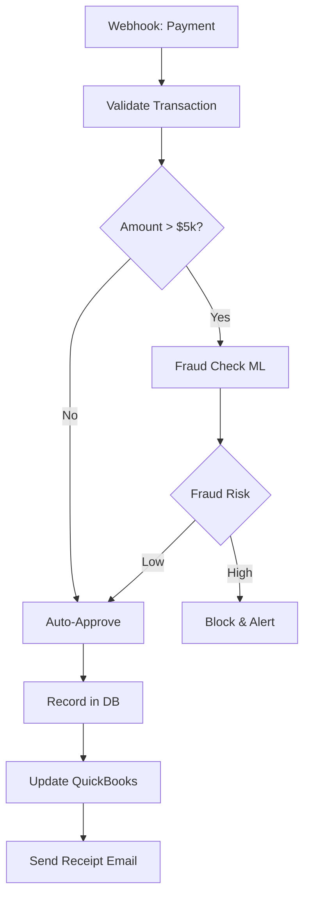
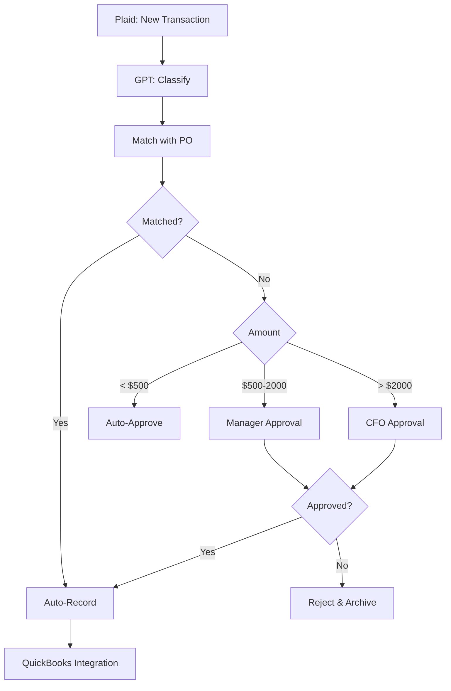
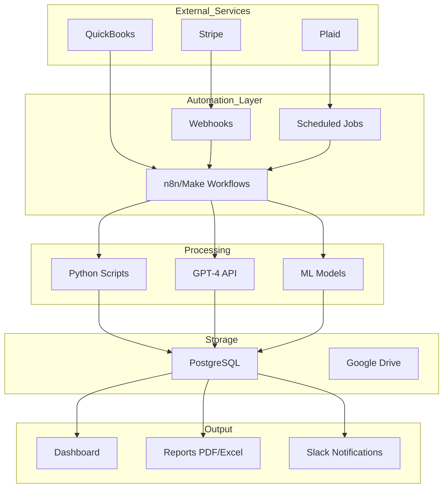

# Sesión 13: Proyecto Integrador Final

## Objetivos del proyecto

Diseñar e implementar un sistema completo de automatización financiera que integre todos los conceptos aprendidos en el curso.

## Especificaciones del proyecto

### Objetivo general

Crear una plataforma automatizada que gestione el ciclo completo de operaciones financieras de una empresa, desde la recepción de ingresos hasta la generación de reportes ejecutivos.

### Componentes requeridos

#### 1. Procesamiento de ingresos (20%)

**Funcionalidades**:
- Webhook para recibir pagos de Stripe/PayPal
- Validación automática de transacciones
- Detección de fraude con ML
- Notificación instantánea de pagos grandes (>$5,000)
- Registro en base de datos

**Tecnologías**: Webhook, Stripe API, ML fraud detection, PostgreSQL/Google Sheets

**Flujo esperado**:



#### 2. Gestión de gastos (15%)

**Funcionalidades**:
- Integración con Plaid para transacciones bancarias
- Clasificación automática de gastos con GPT
- Matching con órdenes de compra
- Workflow de aprobación según monto
- Actualización de sistema contable

**Flujo esperado**:



#### 3. Conciliación bancaria (15%)

**Funcionalidades**:
- Obtener transacciones de múltiples fuentes (Stripe, Plaid, QuickBooks)
- Normalizar formatos de datos
- Algoritmo de matching automático
- Reporte de discrepancias
- Resolución automática de pequeñas diferencias ($< 1)

**Criterios de matching**:
- Monto (tolerancia ±$0.50)
- Fecha (tolerancia ±2 días)
- Descripción (similarity > 70%)

#### 4. Análisis y reporting (20%)

**Funcionalidades**:
- Dashboard interactivo con métricas clave
- Reporte semanal automatizado (PDF + Excel)
- Detección de anomalías con ML
- Forecasting de ingresos (próximos 30 días)
- Alertas proactivas (cash runway < 60 días)

**Métricas requeridas**:
- Revenue (diario, semanal, mensual)
- Burn rate
- Cash runway
- Top customers
- Expense breakdown por categoría
- MoM/YoY growth rates

#### 5. Compliance y auditoría (10%)

**Funcionalidades**:
- Logging completo de todas las transacciones
- Audit trail inmutable
- Generación de reportes regulatorios
- Verificación KYC/AML para nuevos clientes
- Retention de documentos según regulación

#### 6. Integración con IA (10%)

**Funcionalidades**:
- Chatbot financiero (Slack/Teams)
- Responde preguntas sobre datos financieros
- Genera análisis on-demand
- Extrae datos de facturas PDF con GPT
- Sentiment analysis de noticias del sector

#### 7. Alertas y notificaciones (10%)

**Funcionalidades**:
- Slack: Notificaciones en tiempo real
- Email: Reportes diarios/semanales
- SMS: Alertas críticas (fraude, cash runway)
- Dashboard: Resumen ejecutivo

**Tipos de alertas**:
- 🚨 **Críticas**: Fraude detectado, cash < 30 días
- ⚠️ **Advertencias**: Revenue down >10%, anomalías
- ℹ️ **Informativas**: Pagos recibidos, reportes listos

## Arquitectura técnica

### Stack tecnológico recomendado

```yaml
Automatización:
  - Plataforma principal: n8n / Make / Zapier (elegir 1)
  - Hosting: Cloud (n8n Cloud, Make, Zapier) o self-hosted

APIs:
  - Pagos: Stripe API
  - Banking: Plaid API
  - Accounting: QuickBooks API o Google Sheets API
  - Market Data: Alpha Vantage
  - IA: OpenAI GPT-4 API

Data Storage:
  - Transaccional: PostgreSQL / MySQL
  - Alternativa: Google Sheets (si volumen bajo)
  - Documentos: Google Drive / AWS S3

ML/Analytics:
  - Python (pandas, scikit-learn, prophet)
  - Jupyter Notebooks para análisis exploratorio

Notificaciones:
  - Slack API
  - Gmail / SendGrid
  - Twilio (SMS)

Dashboards:
  - Google Data Studio / Looker Studio
  - Metabase
  - Custom (React + Charts.js)
```

### Diagrama de arquitectura



## Requisitos de entregables

### 1. Código y Configuración (40%)

**Debe incluir**:
- Workflows exportados (.json)
- Scripts Python documentados
- Archivo de configuración (.env.example)
- Instrucciones de setup (README.md)
- Diagrama de arquitectura

**Criterios de evaluación**:
- Funcionalidad completa
- Código limpio y comentado
- Error handling robusto
- Seguridad (credenciales, validación)
- Logs apropiados

### 2. Documentación técnica (20%)

**Contenido requerido**:
- Arquitectura del sistema
- Descripción de cada workflow
- Diagramas de flujo
- Decisiones técnicas justificadas
- Instrucciones de deployment
- Troubleshooting guide

**Formato**: Markdown o PDF, 10-15 páginas

### 3. Documentación de usuario (15%)

**Contenido**:
- Guía de uso del sistema
- Cómo interpretar dashboards
- Cómo responder a alertas
- FAQs

**Formato**: PDF, 5-8 páginas

### 4. Video demo (15%)

**Duración**: 10-15 minutos

**Debe mostrar**:
- Flujo end-to-end de una transacción
- Generación de reporte automático
- Detección y respuesta a anomalía
- Uso del chatbot financiero
- Dashboard en acción

**Formato**: MP4, screenshare con narración

### 5. Presentación Ejecutiva (10%)

**Duración**: 10-15 slides

**Contenido**:
- Problema resuelto
- Solución implementada
- Tecnologías utilizadas
- Resultados y métricas
- ROI estimado
- Próximos pasos

## Rúbrica de evaluación

| Componente | Peso | Excelente (90-100%) | Bueno (70-89%) | Aceptable (50-69%) | Insuficiente (<50%) |
|------------|------|---------------------|----------------|-------------------|---------------------|
| **Funcionalidad** | 35% | Todos los componentes funcionan perfectamente | Componentes principales funcionan | Funcionalidad básica | No funciona |
| **Código** | 20% | Código limpio, documentado, best practices | Código funcional, documentación básica | Código poco organizado | Código difícil de entender |
| **Arquitectura** | 15% | Diseño escalable, bien pensado | Arquitectura sólida | Arquitectura básica | Arquitectura problemática |
| **Documentación** | 15% | Completa, clara, profesional | Buena documentación | Documentación básica | Documentación insuficiente |
| **Innovación** | 10% | Características únicas, IA bien integrada | Buen uso de tecnologías | Implementación estándar | Implementación básica |
| **Presentación** | 5% | Excelente demo y presentación | Buena presentación | Presentación básica | Presentación pobre |

## Casos de uso sugeridos

### Opción A: Startup SaaS

Sistema para startup que procesa pagos de suscripciones, gestiona gastos operativos, y genera reportes para inversores.

**Características específicas**:
- MRR tracking
- Churn analysis
- Unit economics
- Investor reports

### Opción B: E-commerce

Plataforma para tienda online que procesa múltiples métodos de pago, gestiona inventario financiero, y genera reportes de ventas.

**Características específicas**:
- Multi-currency support
- Inventory valuation
- Sales analytics por producto
- Tax reporting

### Opción C: Fintech

Sistema para empresa fintech que procesa transacciones de clientes, detecta fraude, y cumple con regulaciones.

**Características específicas**:
- Real-time fraud detection
- AML/KYC automation
- Regulatory reporting
- Risk scoring

### Opción D: Proyecto Personalizado

Puedes proponer tu propio caso de uso, debe ser aprobado previamente y cumplir con complejidad similar.

## Timeline sugerido

| Semana | Actividades |
|--------|-------------|
| **1** | Diseño de arquitectura, selección de tecnologías, setup inicial |
| **2** | Implementación módulos de ingresos y gastos |
| **3** | Implementación conciliación y reporting |
| **4** | Integración IA, testing, optimización |
| **5** | Documentación, video, presentación |

## Recursos de soporte

### Office hours

- **Horario**: Martes y jueves 18:00-20:00
- **Formato**: Zoom (link en campus virtual)
- **Agenda**: Resolver dudas técnicas, revisar progreso

### Slack channel

- **#proyecto-final**: Dudas generales
- **#proyecto-technical**: Ayuda técnica
- **#proyecto-showcases**: Compartir avances

### Ejemplos de referencia

- [Financial Automation Templates](https://n8n.io/workflows/?categories=Finance)
- [Stripe Integration Examples](https://github.com/stripe-samples)
- [Financial ML Notebooks](https://github.com/financial-ml)

## Presentación Final

### Fecha

Última semana del curso (ver calendario)

### Formato

- **Duración**: 20 minutos (15 presentación + 5 Q&A)
- **Modalidad**: Zoom (grabado)
- **Asistencia**: Obligatoria para todos los estudiantes

### Criterios adicionales

- Claridad en la explicación
- Respuesta a preguntas técnicas
- Demo en vivo (o video si issues técnicos)

## Consejos para el éxito

!!! tip "Tips Importantes"
    1. **Empieza temprano**: No dejes todo para última semana
    2. **Itera**: Versión funcional básica primero, luego mejora
    3. **Testea constantemente**: No esperes al final para testing
    4. **Documenta mientras desarrollas**: Más fácil que hacerlo al final
    5. **Pide ayuda cuando te atores**: No pierdas días en un bug
    6. **Presenta avances**: Usa las office hours para feedback
    7. **Backup**: Guarda todo en Git, cloud storage
    8. **Simplicidad**: Mejor pocas features bien hechas que muchas mal implementadas

## FAQs

**P: ¿Puedo trabajar en equipo?**  
R: Sí, equipos de máximo 2 personas. Ambos deben contribuir equitativamente.

**P: ¿Tengo que usar todas las tecnologías mencionadas?**  
R: No, puedes elegir alternativas equivalentes, pero debes justificar.

**P: ¿Puedo usar APIs de prueba/sandbox?**  
R: Sí, de hecho es recomendado. No uses datos reales.

**P: ¿Qué pasa si una API externa falla durante la demo?**  
R: Por eso recomendamos video pre-grabado como backup.

**P: ¿Puedo extender el proyecto con features adicionales?**  
R: Sí, features extra pueden sumar puntos de innovación.

**P: ¿El proyecto tiene que estar en producción?**  
R: No, pero debe ser funcional en ambiente de desarrollo.

## Ejemplo de proyecto completo

Ver en repositorio: `examples/complete-financial-automation`

Incluye:
- Workflows completos
- Scripts Python
- Configuración Docker
- Datos de prueba
- Video demo

## Conclusión

Este proyecto integrador es tu oportunidad de demostrar todo lo aprendido y crear un portfolio piece valioso para tu carrera profesional.

¡Éxito en tu proyecto!

---

## Recursos finales

- [Documentación Completa del Curso](../index.md)
- [Slack del Curso](#)
- [Office Hours Calendar](#)
- [Ejemplos de Proyectos Anteriores](#)

## Contacto

**Profesor**: [Nombre]  
**Email**: profesor@viu.es  
**Office Hours**: Martes y Jueves 18:00-20:00  
**Slack**: @profesor

---

!!! success "¡Felicitaciones!"
    Has completado el curso de Automatización de Procesos Financieros. Ahora tienes las herramientas para transformar operaciones financieras con automatización inteligente. ¡Mucho éxito en tu proyecto!
