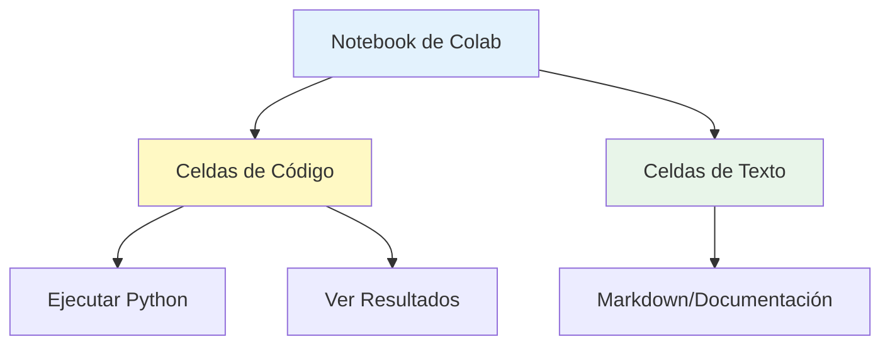
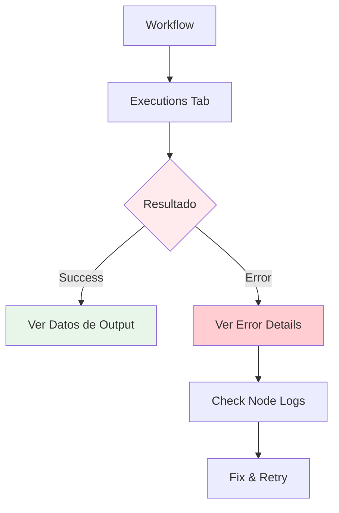

# Sesión 2: Fundamentos de Python y Google Colab

## Objetivos de aprendizaje

Al finalizar esta sesión, serás capaz de:

- Dominar los fundamentos de Python para automatización
- Trabajar eficientemente con Google Colab
- Utilizar estructuras de datos: listas, diccionarios, tuplas
- Crear funciones reutilizables
- Manejar archivos y datos externos
- Implementar control de flujo (if, for, while)

## Python: El lenguaje de las finanzas modernas

Python se ha convertido en el estándar de facto en finanzas por su:

- 🚀 **Sintaxis clara**: Código legible y fácil de mantener
- 📊 **Bibliotecas potentes**: numpy, pandas, scipy, etc.
- 🔗 **Integración**: APIs, bases de datos, cloud
- 🤖 **Machine Learning**: sklearn, tensorflow, pytorch
- 📈 **Comunidad**: Millones de desarrolladores

!!! quote "Guido van Rossum (Creador de Python)"
    *"Python es un lenguaje donde la claridad y la elegibilidad del código son muy importantes."*

## Google Colab en profundidad

### ¿Qué es Google Colab?

**Google Colaboratory** es un entorno Jupyter Notebook alojado en la nube de Google que:

✅ No requiere configuración  
✅ Acceso gratuito a GPUs y TPUs  
✅ Integración con Google Drive  
✅ Bibliotecas preinstaladas  
✅ Compartir como Google Docs  

### Ventajas para finanzas

| Característica | Beneficio |
|----------------|-----------|
| **Cloud-based** | Ejecutar desde cualquier lugar |
| **Gratuito** | Sin costos de infraestructura |
| **Colaborativo** | Trabajo en equipo en tiempo real |
| **GPU gratis** | Entrenar modelos ML complejos |
| **Persistencia** | Guardar en Drive automáticamente |

### Estructura de un Notebook



### Primeros pasos en Colab

#### Crear un nuevo notebook

1. Visita [colab.research.google.com](https://colab.research.google.com)
2. `File → New Notebook`
3. Renombrar: Click en "Untitled"
4. Guardar: `File → Save` (guarda en Google Drive)

#### Tipos de celdas

**Celda de código:**

```python
# Ejecutar con Ctrl+Enter o Shift+Enter
print("Hola desde Python!")
resultado = 2 + 2
```

**Celda de texto (Markdown):**

```markdown
# Título
## Subtítulo

**Negrita** y *cursiva*

- Lista
- De items

Código inline: `print()`
```

### Comandos mágicos de Colab

```python
# Comandos del sistema (!) - ejecutar comandos shell
!pip install yfinance
!ls -la

# Ver directorio actual
!pwd

# Instalar múltiples paquetes
!pip install yfinance pandas-datareader alpha-vantage

# Clonar repositorio git
!git clone https://github.com/usuario/repo.git

# Comandos mágicos (%)
%time  # Medir tiempo de ejecución
%matplotlib inline  # Visualizar gráficos en notebook

# Ver variables en memoria
%whos
```

### Integración con Google Drive

```python
# Montar Google Drive
from google.colab import drive
drive.mount('/content/drive')

# Leer archivo de Drive
import pandas as pd
df = pd.read_csv('/content/drive/MyDrive/datos_financieros.csv')

# Guardar archivo en Drive
df.to_csv('/content/drive/MyDrive/resultados.csv', index=False)

# Listar archivos en Drive
!ls "/content/drive/MyDrive"
```

## Fundamentos de Python

### Variables y tipos de datos

```python
# Números
precio = 175.50        # float
cantidad = 100         # int
ganancia = precio * cantidad  # 17550.0

# Cadenas de texto (strings)
ticker = "AAPL"
empresa = "Apple Inc."
mensaje = f"El precio de {ticker} es ${precio}"  # f-string

# Booleanos
es_compra = True
es_venta = False

# None (ausencia de valor)
precio_objetivo = None

# Tipos de datos
print(type(precio))     # <class 'float'>
print(type(ticker))     # <class 'str'>
print(type(es_compra))  # <class 'bool'>

# Conversiones
precio_str = "175.50"
precio_float = float(precio_str)  # 175.5
cantidad_str = str(cantidad)      # "100"
```

### Listas (arrays ordenados)

```python
# Crear lista
precios = [175.50, 176.20, 174.80, 177.00]
tickers = ['AAPL', 'GOOGL', 'MSFT', 'AMZN']

# Acceder elementos (índice empieza en 0)
primer_precio = precios[0]      # 175.50
ultimo_precio = precios[-1]     # 177.00
segundo_ticker = tickers[1]     # 'GOOGL'

# Slicing (rebanadas)
primeros_dos = precios[0:2]     # [175.50, 176.20]
ultimos_dos = precios[-2:]      # [174.80, 177.00]

# Agregar elementos
precios.append(178.30)
tickers.extend(['TSLA', 'NVDA'])

# Eliminar elementos
precios.remove(174.80)          # Eliminar por valor
ticker_eliminado = tickers.pop()  # Eliminar último (retorna)

# Operaciones
longitud = len(precios)         # Número de elementos
maximo = max(precios)           # Precio máximo
minimo = min(precios)           # Precio mínimo
promedio = sum(precios) / len(precios)

# Verificar existencia
existe = 'AAPL' in tickers      # True

# Ordenar
precios_ordenados = sorted(precios)  # No modifica original
precios.sort()                   # Modifica original
precios.sort(reverse=True)       # Descendente

# List comprehension (creación avanzada)
precios_aumentados = [p * 1.1 for p in precios]  # +10%
precios_altos = [p for p in precios if p > 176]
```

### Diccionarios (pares clave-valor)

```python
# Crear diccionario
accion = {
    'ticker': 'AAPL',
    'nombre': 'Apple Inc.',
    'precio': 175.50,
    'cantidad': 100,
    'moneda': 'USD'
}

# Acceder valores
precio = accion['precio']              # 175.50
nombre = accion.get('nombre')          # 'Apple Inc.'
capitalización = accion.get('cap', 0)  # 0 (default si no existe)

# Modificar/agregar
accion['precio'] = 176.20
accion['sector'] = 'Technology'

# Eliminar
del accion['moneda']

# Verificar existencia
tiene_precio = 'precio' in accion      # True

# Iterar
for clave, valor in accion.items():
    print(f"{clave}: {valor}")

# Claves y valores
claves = accion.keys()
valores = accion.values()

# Diccionario de portafolio
portafolio = {
    'AAPL': {'precio': 175.50, 'cantidad': 100},
    'GOOGL': {'precio': 145.20, 'cantidad': 50},
    'MSFT': {'precio': 420.00, 'cantidad': 75}
}

# Acceder datos anidados
precio_apple = portafolio['AAPL']['precio']  # 175.50
cantidad_google = portafolio['GOOGL']['cantidad']  # 50

# Dictionary comprehension
precios_dict = {t: 0 for t in tickers}  # {'AAPL': 0, 'GOOGL': 0, ...}
```

### Tuplas (inmutables)

```python
# Crear tupla
coordenadas = (40.7128, -74.0060)  # Lat, Long de NYC
dimensiones = (1920, 1080)

# Acceder elementos
latitud = coordenadas[0]    # 40.7128
longitud = coordenadas[1]   # -74.0060

# Desempaquetar
lat, long = coordenadas
ancho, alto = dimensiones

# No se pueden modificar (inmutables)
# coordenadas[0] = 50  # ❌ Error!

# Uso en finanzas: retornar múltiples valores
def calcular_estadisticas(precios):
    return (max(precios), min(precios), sum(precios)/len(precios))

maximo, minimo, promedio = calcular_estadisticas([100, 105, 103, 107])
```

### Sets (conjuntos únicos)

```python
# Crear set
tickers_nasdaq = {'AAPL', 'GOOGL', 'MSFT', 'AMZN'}
tickers_sp500 = {'AAPL', 'MSFT', 'JPM', 'BAC'}

# Operaciones de conjuntos
en_ambos = tickers_nasdaq & tickers_sp500      # Intersección
en_alguno = tickers_nasdaq | tickers_sp500     # Unión
solo_nasdaq = tickers_nasdaq - tickers_sp500   # Diferencia

# Agregar/eliminar
tickers_nasdaq.add('TSLA')
tickers_nasdaq.remove('AMZN')

# Eliminar duplicados de lista
precios = [100, 105, 100, 107, 105, 110]
precios_unicos = list(set(precios))  # [100, 105, 107, 110]
```



### Debugging tips

!!! tip "Mejores Prácticas de Debug"
    1. **Usa nodos "Set" temporales** para inspeccionar datos
    2. **Ejecuta nodo por nodo** (botón "Execute Node" individual)
    3. **Revisa el JSON output** en cada nodo
    4. **Usa try-catch en Functions** para capturar errores
    5. **Activa logging** para producción

### Ejemplo de error handling

```javascript
// Nodo: Function con manejo robusto de errores

try {
  const data = $json;
  
  // Validar que existan datos
  if (!data || !data.amount) {
    throw new Error('Datos incompletos: falta campo amount');
  }
  
  // Procesar
  const result = processFinancialData(data);
  
  return [{ json: result }];
  
} catch (error) {
  // Registrar error
  console.error('Error en procesamiento:', error.message);
  
  // Retornar formato estándar de error
  return [{
    json: {
      error: true,
      message: error.message,
      timestamp: new Date().toISOString(),
      input_data: $json
    }
  }];
}

function processFinancialData(data) {
  // Lógica de procesamiento
  return {
    processed: true,
    amount: parseFloat(data.amount),
    currency: data.currency || 'USD'
  };
}
```

## Ejercicio práctico

### Tarea: monitor de tipo de cambio

**Objetivo**: Crear workflow que monitoree EUR/USD cada 30 minutos y alerte si cambia más del 1%.

**Requisitos**:

1. Trigger: Cada 30 minutos
2. API: https://api.exchangerate-api.com/v4/latest/EUR
3. Almacenar último valor en variable
4. Calcular cambio porcentual
5. Si cambio > 1%, enviar notificación
6. Registrar en Google Sheets

**Entregable**: Exportar workflow en JSON

## Recursos y comunidad

### Documentación oficial

- [n8n Docs](https://docs.n8n.io/)
- [n8n Cookbook](https://docs.n8n.io/workflows/examples/)
## Control de flujo

### Condicionales (if, elif, else)

```python
# If simple
precio = 175.50
if precio > 180:
    print("Precio alto")

# If-else
if precio > 180:
    print("Precio alto - considerar vender")
else:
    print("Precio normal - mantener")

# If-elif-else (múltiples condiciones)
if precio > 200:
    accion = "Vender"
elif precio > 150:
    accion = "Mantener"
else:
    accion = "Comprar"

print(f"Recomendación: {accion}")

# Operadores lógicos
precio = 175
volumen = 1000000

if precio > 170 and volumen > 500000:
    print("Buen momento para operar")

if precio < 150 or volumen > 2000000:
    print("Situación atípica")

# Operador ternario (inline)
estado = "Alto" if precio > 180 else "Bajo"
```

### Caso práctico: Sistema de alertas

```python
def evaluar_accion(ticker, precio, objetivo_compra, objetivo_venta):
    """
    Evalúa una acción y genera recomendación
    
    Args:
        ticker (str): Símbolo de la acción
        precio (float): Precio actual
        objetivo_compra (float): Precio objetivo para comprar
        objetivo_venta (float): Precio objetivo para vender
    
    Returns:
        str: Recomendación
    """
    if precio <= objetivo_compra:
        return f"🔵 {ticker}: COMPRAR a ${precio} (objetivo: ${objetivo_compra})"
    elif precio >= objetivo_venta:
        return f"🔴 {ticker}: VENDER a ${precio} (objetivo: ${objetivo_venta})"
    else:
        diferencia_compra = precio - objetivo_compra
        diferencia_venta = objetivo_venta - precio
        porcentaje = (diferencia_compra / (diferencia_compra + diferencia_venta)) * 100
        return f"🟡 {ticker}: MANTENER a ${precio} (en zona {porcentaje:.1f}%)"

# Usar función
print(evaluar_accion('AAPL', 175, 170, 185))
print(evaluar_accion('GOOGL', 140, 145, 155))
print(evaluar_accion('MSFT', 425, 400, 420))
```

**Salida:**
```
🔴 AAPL: VENDER a $175 (objetivo: $185)
🔵 GOOGL: COMPRAR a $140 (objetivo: $145)
🔴 MSFT: VENDER a $425 (objetivo: $420)
```

### Bucles (loops)

#### For loop - iterar sobre secuencias

```python
# Iterar lista
tickers = ['AAPL', 'GOOGL', 'MSFT', 'AMZN']
for ticker in tickers:
    print(f"Procesando {ticker}...")

# Con enumerate (índice + valor)
for i, ticker in enumerate(tickers):
    print(f"{i+1}. {ticker}")

# Range (rango de números)
for i in range(5):  # 0, 1, 2, 3, 4
    print(f"Iteración {i}")

for i in range(1, 6):  # 1, 2, 3, 4, 5
    print(f"Día {i}")

# Iterar diccionario
portafolio = {'AAPL': 100, 'GOOGL': 50, 'MSFT': 75}
for ticker, cantidad in portafolio.items():
    print(f"{ticker}: {cantidad} acciones")

# List comprehension con for
precios = [100, 105, 103, 107, 110]
precios_aumentados = [p * 1.05 for p in precios]  # +5%
print(precios_aumentados)
```

#### While loop - repetir mientras condición sea verdadera

```python
# Ejemplo: monitorear hasta alcanzar objetivo
precio_actual = 170
precio_objetivo = 180
dias = 0

while precio_actual < precio_objetivo:
    # Simular cambio de precio
    import random
    cambio = random.uniform(-2, 3)
    precio_actual += cambio
    dias += 1
    print(f"Día {dias}: ${precio_actual:.2f}")
    
    if dias > 30:  # Límite de seguridad
        print("Timeout: objetivo no alcanzado en 30 días")
        break

# Break y continue
for precio in [100, 105, 0, 110, 115]:
    if precio == 0:
        print("Dato inválido, saltando...")
        continue  # Saltar a siguiente iteración
    
    if precio > 112:
        print("Precio muy alto, deteniendo...")
        break  # Salir del loop completamente
    
    print(f"Precio: ${precio}")
```

## Funciones

### Definición básica

```python
# Función simple
def saludar():
    print("Hola desde Python!")

# Llamar función
saludar()

# Función con parámetros
def calcular_ganancia(precio_compra, precio_venta, cantidad):
    ganancia_por_accion = precio_venta - precio_compra
    ganancia_total = ganancia_por_accion * cantidad
    return ganancia_total

# Usar función
resultado = calcular_ganancia(100, 110, 50)
print(f"Ganancia: ${resultado}")
```

### Parámetros avanzados

```python
# Parámetros con valores por defecto
def obtener_precio(ticker, mercado='NYSE', moneda='USD'):
    print(f"Obteniendo {ticker} de {mercado} en {moneda}")
    return 100.0  # Simulado

# Diferentes formas de llamar
obtener_precio('AAPL')                    # USA defaults
obtener_precio('AAPL', 'NASDAQ')          # Cambia mercado
obtener_precio('AAPL', moneda='EUR')      # Parámetro nombrado

# Args variables (*args) - múltiples argumentos
def calcular_promedio(*precios):
    """Acepta cualquier número de precios"""
    if len(precios) == 0:
        return 0
    return sum(precios) / len(precios)

print(calcular_promedio(100, 105, 103))
print(calcular_promedio(100, 110, 105, 107, 103, 108))

# Kwargs variables (**kwargs) - parámetros nombrados
def crear_orden(**parametros):
    """Acepta cualquier parámetro nombrado"""
    print("Orden creada:")
    for clave, valor in parametros.items():
        print(f"  {clave}: {valor}")

crear_orden(
    ticker='AAPL',
    cantidad=100,
    tipo='compra',
    precio_limite=175
)
```

### Docstrings y type hints

```python
def calcular_roi(inversion_inicial: float, valor_final: float, 
                 periodo_anos: int) -> tuple:
    """
    Calcula el Return on Investment (ROI)
    
    Args:
        inversion_inicial (float): Monto invertido inicialmente
        valor_final (float): Valor al final del período
        periodo_anos (int): Número de años de inversión
    
    Returns:
        tuple: (roi_porcentaje, roi_anualizado, ganancia_absoluta)
    
    Example:
        >>> calcular_roi(10000, 15000, 3)
        (50.0, 14.47, 5000.0)
    """
    ganancia = valor_final - inversion_inicial
    roi = (ganancia / inversion_inicial) * 100
    roi_anualizado = ((valor_final / inversion_inicial) ** (1 / periodo_anos) - 1) * 100
    
    return (roi, roi_anualizado, ganancia)

# Usar función
roi, roi_anual, ganancia = calcular_roi(10000, 15000, 3)
print(f"ROI Total: {roi:.2f}%")
print(f"ROI Anualizado: {roi_anual:.2f}%")
print(f"Ganancia: ${ganancia:,.2f}")
```

### Funciones lambda (anónimas)

```python
# Lambda simple
cuadrado = lambda x: x ** 2
print(cuadrado(5))  # 25

# Lambda con múltiples parámetros
suma = lambda a, b: a + b
print(suma(10, 20))  # 30

# Uso común: ordenar con criterio custom
acciones = [
    {'ticker': 'AAPL', 'precio': 175},
    {'ticker': 'GOOGL', 'precio': 145},
    {'ticker': 'MSFT', 'precio': 420}
]

# Ordenar por precio
ordenadas = sorted(acciones, key=lambda x: x['precio'])
print([a['ticker'] for a in ordenadas])  # ['GOOGL', 'AAPL', 'MSFT']

# Map, filter, reduce con lambda
precios = [100, 105, 103, 107, 110]

# Map: aplicar función a todos
precios_con_iva = list(map(lambda p: p * 1.21, precios))

# Filter: filtrar elementos
precios_altos = list(filter(lambda p: p > 104, precios))

# Reduce: acumular (requiere import)
from functools import reduce
suma_total = reduce(lambda a, b: a + b, precios)
```

## Manejo de archivos

### Lectura y escritura básica

```python
# Escribir en archivo
datos_portafolio = """AAPL,100,175.50
GOOGL,50,145.20
MSFT,75,420.00"""

with open('portafolio.csv', 'w') as archivo:
    archivo.write(datos_portafolio)

# Leer archivo
with open('portafolio.csv', 'r') as archivo:
    contenido = archivo.read()
    print(contenido)

# Leer línea por línea
with open('portafolio.csv', 'r') as archivo:
    for linea in archivo:
        ticker, cantidad, precio = linea.strip().split(',')
        print(f"{ticker}: {cantidad} acciones a ${precio}")

# Append (agregar al final)
with open('portafolio.csv', 'a') as archivo:
    archivo.write("\nTSLA,25,250.00")
```

### Trabajar con CSV

```python
import csv

# Escribir CSV
acciones = [
    ['Ticker', 'Cantidad', 'Precio', 'Valor Total'],
    ['AAPL', 100, 175.50, 17550],
    ['GOOGL', 50, 145.20, 7260],
    ['MSFT', 75, 420.00, 31500]
]

with open('portafolio_detallado.csv', 'w', newline='') as archivo:
    writer = csv.writer(archivo)
    writer.writerows(acciones)

# Leer CSV
with open('portafolio_detallado.csv', 'r') as archivo:
    reader = csv.reader(archivo)
    next(reader)  # Saltar encabezado
    for fila in reader:
        ticker, cantidad, precio, valor = fila
        print(f"{ticker}: ${float(precio):.2f}")

# CSV a diccionario
with open('portafolio_detallado.csv', 'r') as archivo:
    reader = csv.DictReader(archivo)
    for fila in reader:
        print(fila['Ticker'], fila['Precio'])
```

### Trabajar con JSON

```python
import json

# Datos en Python
portafolio_data = {
    "usuario": "investor_123",
    "acciones": [
        {"ticker": "AAPL", "cantidad": 100, "precio": 175.50},
        {"ticker": "GOOGL", "cantidad": 50, "precio": 145.20}
    ],
    "efectivo": 10000,
    "moneda": "USD"
}

# Guardar JSON
with open('portafolio.json', 'w') as archivo:
    json.dump(portafolio_data, archivo, indent=2)

# Leer JSON
with open('portafolio.json', 'r') as archivo:
    datos = json.load(archivo)
    print(f"Usuario: {datos['usuario']}")
    print(f"Efectivo: ${datos['efectivo']}")
    for accion in datos['acciones']:
        print(f"  {accion['ticker']}: {accion['cantidad']} acciones")

# JSON string ↔ dict
json_string = '{"precio": 175.50, "ticker": "AAPL"}'
datos_dict = json.loads(json_string)  # string → dict
json_output = json.dumps(datos_dict)  # dict → string
```

## Ejercicios prácticos

### Ejercicio 1: Analizador de portafolio básico

Crea un programa que:

1. Almacene un portafolio en un diccionario
2. Calcule el valor total
3. Identifique la acción con mayor inversión

```python
# Tu código aquí
portafolio = {
    'AAPL': {'cantidad': 100, 'precio_compra': 150},
    'GOOGL': {'cantidad': 50, 'precio_compra': 130},
    'MSFT': {'cantidad': 75, 'precio_compra': 300}
}

# Calcular valor total
# Encontrar la acción con mayor inversión
# Mostrar resultados
```

### Ejercicio 2: Filtrador de acciones

Crea una función que reciba una lista de diccionarios con información de acciones y:

1. Filtre las que tienen precio > $100
2. Ordene por precio descendente
3. Retorne solo los tickers

```python
acciones = [
    {'ticker': 'AAPL', 'precio': 175.50},
    {'ticker': 'NVDA', 'precio': 880.00},
    {'ticker': 'AMD', 'precio': 95.00},
    {'ticker': 'MSFT', 'precio': 420.00},
    {'ticker': 'INTC', 'precio': 45.00}
]

def filtrar_acciones_caras(acciones, precio_minimo=100):
    # Tu código aquí
    pass

resultado = filtrar_acciones_caras(acciones)
print(resultado)  # Debe mostrar: ['NVDA', 'MSFT', 'AAPL']
```

### Ejercicio 3: Guardado de transacciones

Crea un sistema que:

1. Permita agregar transacciones (compra/venta)
2. Guarde las transacciones en un archivo CSV
3. Calcule el balance total

```python
def agregar_transaccion(tipo, ticker, cantidad, precio):
    """
    Agrega una transacción al registro
    tipo: 'compra' o 'venta'
    """
    # Tu código aquí
    pass

def calcular_balance():
    """
    Lee el archivo de transacciones y calcula balance
    """
    # Tu código aquí
    pass

# Probar
agregar_transaccion('compra', 'AAPL', 100, 150)
agregar_transacción('Venta', 'AAPL', 50, 175)
print(f"Balance: ${calcular_balance()}")
```

## Recursos adicionales

### Documentación oficial

- [Python Official Tutorial](https://docs.python.org/3/tutorial/)
- [Google Colab Welcome Notebook](https://colab.research.google.com/notebooks/intro.ipynb)
- [Python Standard Library](https://docs.python.org/3/library/)

### Tutoriales recomendados

- [Python para Todos](https://www.py4e.com/) - Libro gratuito en español
- [Real Python - Python Basics](https://realpython.com/python-basics/)
- [Automate the Boring Stuff](https://automatetheboringstuff.com/)

### Práctica interactiva

- [Python Tutor](http://pythontutor.com/) - Visualizar ejecución de código
- [LeetCode](https://leetcode.com/) - Problemas de programación
- [HackerRank Python](https://www.hackerrank.com/domains/python)

## Resumen

En esta sesión aprendimos:

✅ Fundamentos de Python: variables, tipos de datos  
✅ Estructuras de datos: listas, diccionarios, tuplas, sets  
✅ Control de flujo: if, for, while  
✅ Funciones: definición, parámetros, retorno  
✅ Manejo de archivos: CSV, JSON  
✅ Google Colab: entorno, comandos mágicos  
✅ Ejercicios prácticos de finanzas  

**Próxima sesión**: Exploraremos **bibliotecas Python especializadas** para finanzas: pandas, numpy, yfinance, y más.

---

!!! tip "Tarea para la Próxima Sesión"
    1. ✅ Completa los 3 ejercicios prácticos
    2. ✅ Crea un notebook personal en Colab
    3. ✅ Experimenta con los ejemplos de la sesión
    4. ✅ Investiga la biblioteca pandas (leer documentación básica)
    5. ✅ Practica con Python Tutor para visualizar tu código
    6. ✅ Opcional: Resuelve 5 problemas básicos en HackerRank Python

