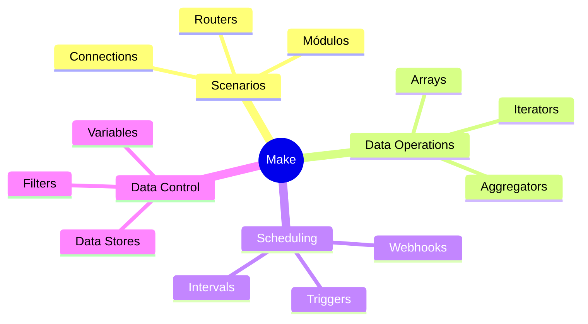
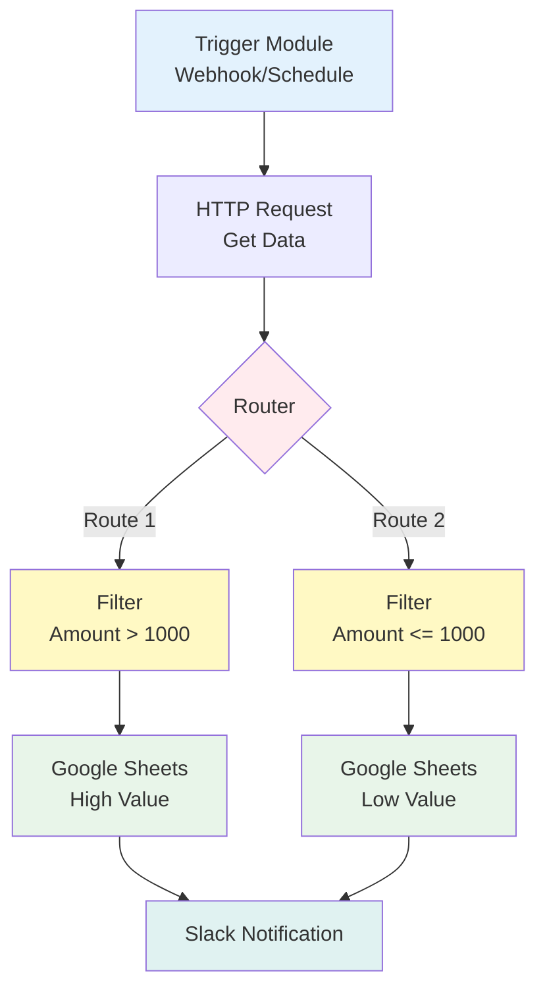
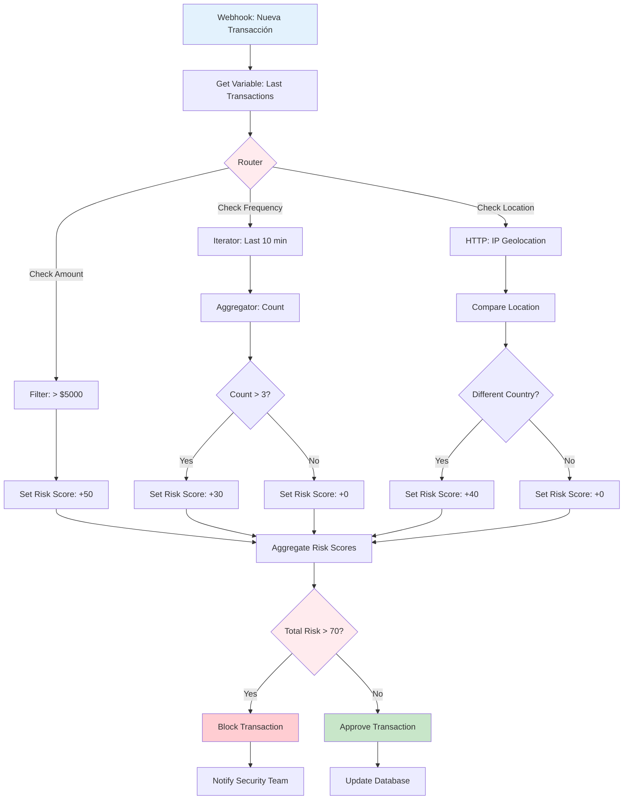
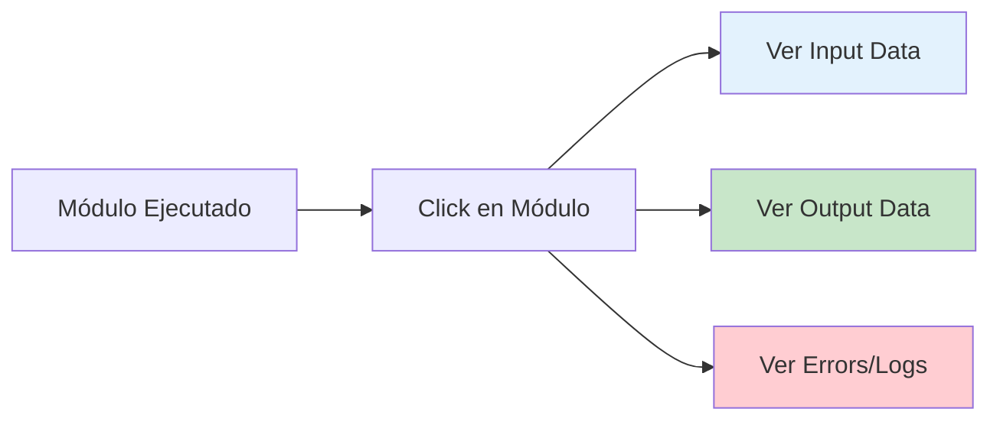

# Sesión 3: Herramienta Make (Integromat)

## Objetivos de aprendizaje

Al finalizar esta sesión, serás capaz de:

- Dominar la interfaz visual de Make
- Crear escenarios complejos con múltiples rutas
- Implementar routers, iterators y aggregators
- Optimizar el consumo de operaciones
- Integrar servicios financieros con Make

## ¿Qué es Make?

**Make** (anteriormente Integromat) es una plataforma visual de automatización que permite crear escenarios complejos sin código mediante un editor de flujos intuitivo.

!!! quote "Slogan de Make"
    *"Make lets you design, build, and automate anything - from tasks and workflows to apps and systems."*

### Make vs n8n vs Zapier

| Característica | Make | n8n | Zapier |
|----------------|------|-----|--------|
| **Visualización** | ⭐⭐⭐⭐⭐ | ⭐⭐⭐ | ⭐⭐ |
| **Complejidad** | Alta | Media-Alta | Media |
| **Precio** | $$ | $ (self) | $$$ |
| **Curva aprendizaje** | Media | Media | Baja |
| **Manejo de datos** | Excelente | Muy bueno | Bueno |
| **Debugging** | Visual detallado | Logs JSON | Básico |

### Conceptos clave de Make



## Registro y configuración

### Crear cuenta

1. Visita [make.com](https://www.make.com)
2. Registra cuenta (gratuito: 1,000 ops/mes)
3. Explora templates

### Planes de precio

| Plan | Operaciones/mes | Escenarios Activos | Precio/mes |
|------|-----------------|-------------------|------------|
| **Free** | 1,000 | 2 | $0 |
| **Core** | 10,000 | 5 | $9 |
| **Pro** | 10,000 | 10 | $16 |
| **Teams** | 40,000 | 50 | $29 |

**Operación** = 1 ejecución de 1 módulo

## Anatomía de un escenario

### Estructura visual



### Tipos de módulos

#### 1. **Triggers** (Disparadores)

- **Webhook**: Recibe HTTP requests
- **Watch**: Monitorea cambios (emails, archivos, DB)
- **Schedule**: Ejecuta en horarios específicos

#### 2. **Actions** (Acciones)

- **Create**: Crear registros
- **Update**: Actualizar datos
- **Search**: Buscar información
- **Delete**: Eliminar elementos

#### 3. **Flow Control** (control de flujo)

- **Router**: Ramificar flujo en múltiples paths
- **Iterator**: Procesar arrays elemento por elemento
- **Aggregator**: Combinar múltiples items
- **Filter**: Condicional para continuar/detener

#### 4. **Tools**

- **Set Variable**: Definir variables
- **Get Variable**: Recuperar variables
- **Sleep**: Pausar ejecución
- **HTTP**: Llamadas API custom

## Funcionalidades avanzadas

### 1. Routers y rutas múltiples

**Caso**: Clasificar transacciones según monto

```
Webhook (Recibe transacción)
    ↓
Router
    ├─→ [Filtro: monto > 10000] → Alerta Ejecutivos
    ├─→ [Filtro: monto 1000-10000] → Revisión Gerencia
    └─→ [Filtro: monto < 1000] → Procesamiento Automático
```

### 2. Iterators (Iteradores)

**Propósito**: Procesar arrays item por item

```
API Response: [transaction1, transaction2, transaction3]
    ↓
Iterator
    ↓
Procesa cada transacción individualmente
    ↓
25 transacciones = 25 operaciones
```

!!! warning "Consumo de Operaciones"
    Cada iteración cuenta como una operación. 100 items = 100 ops.

### 3. Aggregators (Agregadores)

**Propósito**: Combinar múltiples items en uno

```
Iterator procesa 50 transacciones
    ↓
Aggregator (Array Aggregator)
    ↓
Combina en un solo bundle
    ↓
Usa 1 operación para enviar todas juntas
```

**Ejemplo JSON Aggregator**:

```json
{
  "total_transactions": 50,
  "total_amount": 125000,
  "transactions": [
    {"id": 1, "amount": 2500},
    {"id": 2, "amount": 3200},
    ...
  ]
}
```

### 4. Data Stores

**Propósito**: Almacenamiento persistente entre ejecuciones

```
Módulo: Data Store - Add Record
Data Structure: {
  "fecha": "2024-03-27",
  "precio_cierre": 45200,
  "volumen": 18500000
}
```

**Consulta posterior**:

```
Módulo: Data Store - Search Records
Filter: fecha = today - 7 days
```

## Variables y funciones

### Variables en Make

```javascript
// Acceder a datos del módulo anterior
{{1.amount}}  // Campo 'amount' del módulo 1
{{2.customer.email}}  // Nested field

// Variables de sistema
{{now}}  // Timestamp actual
{{trigger}}  // Datos del trigger

// Funciones de texto
{{upper(3.name)}}  // MAYÚSCULAS
{{replace(4.texto; "a"; "b")}}  // Reemplazar

// Funciones matemáticas
{{sum(5.amounts)}}  // Suma de array
{{round(6.price; 2)}}  // Redondear a 2 decimales

// Funciones de fecha
{{formatDate(now; "YYYY-MM-DD")}}
{{addDays(now; 7)}}  // +7 días
```

### Funciones financieras útiles

```javascript
// Calcular porcentaje de cambio
{{((8.precio_actual - 8.precio_anterior) / 8.precio_anterior) * 100}}

// Formato moneda
{{formatNumber(9.amount; 2; ","; ".")}}  // 1.234,56

// Conversión de moneda (usando exchange rate)
{{10.amount * 10.exchange_rate}}

// Agrupar por categoría
{{if(11.type = "income"; 11.amount; 0)}}
```

## Caso práctico: sistema anti-fraude básico

### Objetivo

Detectar transacciones sospechosas basándose en patrones:

- Monto excesivo (>$5,000)
- Múltiples transacciones en corto tiempo
- Ubicación geográfica inusual

### Arquitectura del escenario



### Implementación paso a paso

#### Módulo 1: webhook

```json
{
  "url": "https://hook.make.com/xxxxx",
  "method": "POST",
  "data_structure": {
    "transaction_id": "string",
    "amount": "number",
    "currency": "string",
    "customer_id": "string",
    "ip_address": "string",
    "timestamp": "date"
  }
}
```

#### Módulo 2-4: verificaciones paralelas

**2. Check Amount**

```
Filter Condition:
{{1.amount}} greater than 5000

If true → Set Variable: risk_amount = 50
If false → Set Variable: risk_amount = 0
```

**3. Check Frequency**

```
Data Store Search:
    Store: transactions_log
    Filter: customer_id = {{1.customer_id}}
           AND timestamp > {{addMinutes(now; -10)}}

Iterator → Count

Aggregator (Text Aggregator):
    Formula: {{length(array)}}

Set Variable: risk_frequency = {{if(count > 3; 30; 0)}}
```

**4. Check Geolocation**

```
HTTP Request:
    URL: http://ip-api.com/json/{{1.ip_address}}
    Method: GET

Parse Response:
    {{6.body.country}}

Data Store Get:
    customer_usual_country

Compare:
    If {{6.body.country}} ≠ {{7.country}} → risk_location = 40
    Else → risk_location = 0
```

#### Módulo 5: calcular risk score total

```
Set Variable: total_risk
Formula: {{risk_amount + risk_frequency + risk_location}}
```

#### Módulo 6: decisión y acción

```
Router:
    Route 1 (High Risk): {{total_risk}} > 70
        → Block transaction
        → Notify security team
        → Log to high_risk database
    
    Route 2 (Medium Risk): {{total_risk}} between 40 and 70
        → Flag for manual review
        → Notify fraud team
    
    Route 3 (Low Risk): {{total_risk}} < 40
        → Approve automatically
        → Update normal transactions log
```

### Notificación Slack (ruta high risk)

```json
{
  "text": "🚨 ALERTA: Transacción de Alto Riesgo Detectada",
  "blocks": [
    {
      "type": "section",
      "text": {
        "type": "mrkdwn",
        "text": "*Detalles de la Transacción:*\n• ID: {{1.transaction_id}}\n• Monto: ${{formatNumber(1.amount; 2)}}\n• Cliente: {{1.customer_id}}\n• Risk Score: {{total_risk}}/100"
      }
    },
    {
      "type": "section",
      "text": {
        "type": "mrkdwn",
        "text": "*Razones:*\n{{if(risk_amount > 0; '• Monto excesivo\n'; '')}}{{if(risk_frequency > 0; '• Múltiples transacciones recientes\n'; '')}}{{if(risk_location > 0; '• Ubicación inusual\n'; '')}}"
      }
    },
    {
      "type": "actions",
      "elements": [
        {
          "type": "button",
          "text": {
            "type": "plain_text",
            "text": "Aprobar"
          },
          "style": "primary",
          "url": "https://admin.example.com/approve/{{1.transaction_id}}"
        },
        {
          "type": "button",
          "text": {
            "type": "plain_text",
            "text": "Rechazar"
          },
          "style": "danger",
          "url": "https://admin.example.com/reject/{{1.transaction_id}}"
        }
      ]
    }
  ]
}
```

## Optimización de operaciones

### Estrategias para reducir consumo

!!! tip "Técnicas de Optimización"
    1. **Usa Aggregators** antes de escribir a DB
    2. **Filtra temprano** para evitar procesar datos innecesarios
    3. **Batch operations** cuando la API lo permita
    4. **Data Stores** en lugar de múltiples API calls
    5. **Webhooks** en vez de polling constante

### Ejemplo: optimización de API calls

**❌ Ineficiente** (1,000 operaciones):

```
Get 1000 customers → Iterator → For each: HTTP Request → Get transaction
= 1000 operaciones
```

**✅ Eficiente** (2 operaciones):

```
Get 1000 customer IDs → Array Aggregator → Single HTTP Request (batch)
= 1 operación de DB + 1 API call
```

## Debugging y testing

### Modo de desarrollo

```
1. Activa "Run once" mode
2. Usa datos de prueba en webhook
3. Inspecciona cada módulo
4. Revisa variables en cada paso
```

### Inspector de datos



### Manejo de errores

```
Error Handler Module:
    On Error → Continue to specific route
    
    Routes:
    1. Retry with exponential backoff
    2. Log to error database
    3. Notify admin
    4. Use fallback data
```

**Ejemplo de Retry Logic**:

```
HTTP Request
    ↓ (on error)
Error Handler
    ↓
Sleep (5 seconds)
    ↓
HTTP Request (retry 1)
    ↓ (on error)
Sleep (10 seconds)
    ↓
HTTP Request (retry 2)
    ↓ (on error)
Send Alert to Admin
```

## Integración con APIs financieras

### Alpha Vantage (stock data)

```
HTTP Module:
    URL: https://www.alphavantage.co/query
    Method: GET
    Query Parameters:
        function = TIME_SERIES_DAILY
        symbol = {{ticker}}
        apikey = {{your_api_key}}
        
Parse JSON:
    {{2.body["Time Series (Daily)"].[first]}}
```

### Plaid (banking data)

```
HTTP Module:
    URL: https://production.plaid.com/transactions/get
    Method: POST
    Headers:
        Content-Type: application/json
    Body:
        {
          "client_id": "{{client_id}}",
          "secret": "{{secret}}",
          "access_token": "{{access_token}}",
          "start_date": "{{formatDate(addDays(now; -30); 'YYYY-MM-DD')}}",
          "end_date": "{{formatDate(now; 'YYYY-MM-DD')}}"
        }
```

## Ejercicio práctico

### Tarea: portfolio rebalancing alert

**Objetivo**: Crear escenario que:

1. Obtiene precios de 5 acciones (API)
2. Calcula peso actual de cada una en portfolio
3. Compara con pesos objetivo
4. Si desviación > 5%, genera alerta con recomendaciones

**Datos**:

```json
{
  "portfolio_target": {
    "AAPL": 0.25,
    "GOOGL": 0.25,
    "MSFT": 0.20,
    "AMZN": 0.15,
    "TSLA": 0.15
  },
  "shares_owned": {
    "AAPL": 10,
    "GOOGL": 5,
    "MSFT": 8,
    "AMZN": 3,
    "TSLA": 4
  }
}
```

**Entregable**: Screenshot del escenario + export en .json

## Recursos

### Documentación

- [Make Help Center](https://www.make.com/en/help)
- [Make Academy](https://www.make.com/en/help/academy)
- [Make Community](https://community.make.com/)

### Templates útiles

- Finance & Accounting templates
- Data processing workflows
- API integration examples

## Resumen

En esta sesión dominamos:

✅ Interfaz visual de Make  
✅ Routers, iterators y aggregators  
✅ Variables y funciones avanzadas  
✅ Sistema anti-fraude automatizado  
✅ Optimización de operaciones  
✅ Integración con APIs financieras  

**Próxima sesión**: Exploraremos **Zapier**, la plataforma más establecida con el mayor ecosistema de integraciones.

---

!!! tip "Tarea para la Próxima Sesión"
    1. Completa el ejercicio de portfolio rebalancing
    2. Crea cuenta en Zapier
    3. Explora templates de Make relacionados con finanzas
    4. Identifica un proceso en tu trabajo que puedas automatizar con Make
