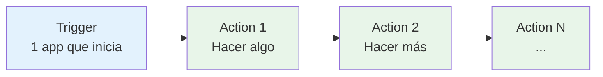
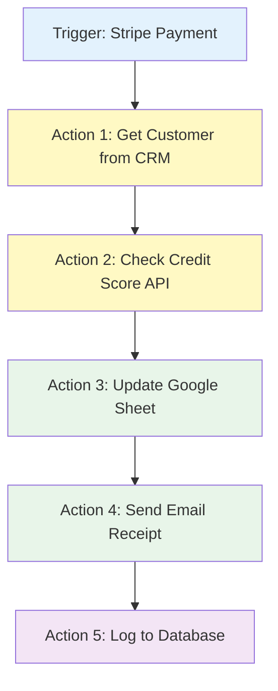
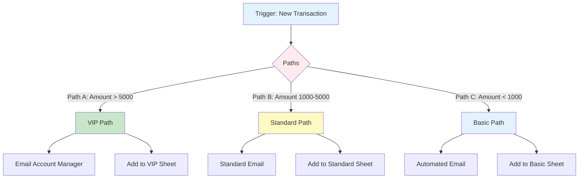
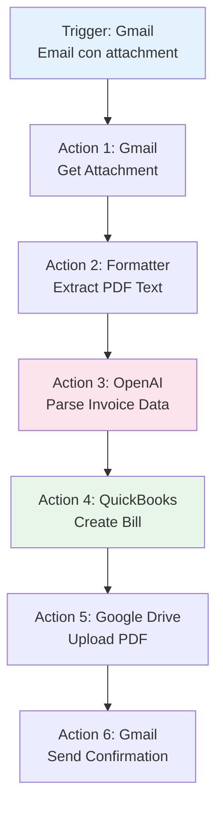
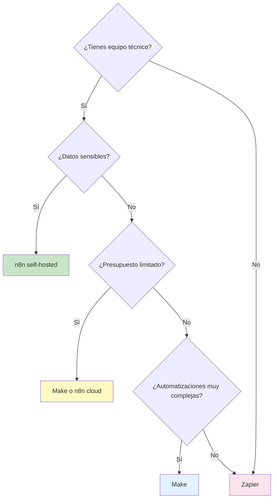

# Sesión 4: Herramienta Zapier

## Objetivos de aprendizaje

Al finalizar esta sesión, serás capaz de:

- Configurar Zaps básicos y multi-step
- Utilizar el ecosistema masivo de integraciones de Zapier
- Implementar lógica condicional con Paths
- Optimizar el consumo de tasks
- Comparar y elegir la herramienta adecuada según el caso de uso

## ¿Qué es Zapier?

**Zapier** es la plataforma de automatización más establecida (fundada en 2011) con el ecosistema de integraciones más grande del mercado: **más de 5,000 aplicaciones**.

!!! quote "Misión de Zapier"
    *"Make automation work for everyone."*

### Ventajas de Zapier

| Ventaja | Descripción |
|---------|-------------|
| **Facilidad de uso** | La curva de aprendizaje más suave |
| **Integraciones** | 5,000+ apps nativas |
| **Confiabilidad** | 99.99% uptime |
| **Documentación** | Guías detalladas para cada app |
| **Soporte** | Excelente customer support |
| **Marketplace** | Miles de templates listos para usar |

### Zapier para finanzas

Integraciones financieras destacadas:

- **Contabilidad**: QuickBooks, Xero, FreshBooks
- **Pagos**: Stripe, PayPal, Square
- **Banking**: Plaid, Yodlee
- **CRM Financiero**: Salesforce Financial Services
- **Inversiones**: Robinhood, TD Ameritrade (APIs)
- **Reportes**: Google Sheets, Excel, Airtable

## Conceptos fundamentales

### Anatomía de un zap



**Trigger** (1 por Zap): Evento que inicia la automatización
**Actions** (múltiples): Tareas que se ejecutan secuencialmente

### Tipos de triggers

1. **Instant** (Webhook): Ejecución inmediata
2. **Polling**: Revisa cambios cada 1-15 minutos (según plan)
3. **Scheduled**: Ejecuta en horarios específicos

### Tasks y consumo

!!! warning "Importante: sistema de tasks"
    Cada acción exitosa cuenta como 1 **task**.
    
    Ejemplo:
    - Trigger: Nuevo email (0 tasks)
    - Action 1: Create row en Sheets **(1 task)**
    - Action 2: Send Slack message **(1 task)**
    - Total: **2 tasks por ejecución**

## Planes y precios

| Plan | Tasks/mes | Zaps | Polling | Precio/mes |
|------|-----------|------|---------|------------|
| **Free** | 100 | 5 | 15 min | $0 |
| **Starter** | 750 | 20 | 15 min | $20 |
| **Professional** | 2,000 | Unlimited | 2 min | $49 |
| **Team** | 50,000 | Unlimited | 1 min | $299 |
| **Company** | 100,000+ | Unlimited | 1 min | $599+ |

## Crear un zap básico

### Ejemplo 1: notificación de grandes transacciones

**Objetivo**: Cuando Stripe procesa un pago >$1,000, notificar en Slack

#### Paso 1: trigger - Stripe

```
App: Stripe
Trigger Event: New Payment
Filter (opcional): Amount > 1000
Test: Sí, usar dato de prueba
```

#### Paso 2: action - Slack

```
App: Slack
Action: Send Channel Message
Channel: #finanzas
Message Text:
    💰 Nueva transacción grande
    
    Monto: ${{amount}}
    Cliente: {{customer_email}}
    ID: {{id}}
    Fecha: {{created}}
Test: Enviar mensaje de prueba
```

#### Resultado

```
Trigger: Stripe payment (amount=1500)
  ↓
Action: Slack message
  ↓
✅ 1 task consumido
```

## Funcionalidades avanzadas

### 1. Multi-Step Zaps

Cadena de acciones secuenciales:



**Tasks consumidos**: 5 (1 por cada action)

### 2. Paths (Lógica Condicional)

**Caso**: Clasificar clientes según monto de transacción



**Configuración de Paths**:

```
Path A (VIP):
    Rule: (Stripe) Amount > 5000
    Actions:
        1. Gmail: Send personalized email
        2. Google Sheets: Add row to "VIP Clients"
        3. Salesforce: Update customer tier
    
Path B (Standard):
    Rule: (Stripe) Amount >= 1000 AND Amount <= 5000
    Actions:
        1. SendGrid: Send standard email
        2. Google Sheets: Add row to "Standard Clients"
    
Path C (Basic):
    Rule: (Stripe) Amount < 1000
    Actions:
        1. Mailchimp: Add to automation sequence
```

!!! tip "Optimización con Paths"
    Solo se ejecuta UNA path, consumiendo solo esas tasks.
    Si ningún path coincide, el Zap termina sin consumir tasks adicionales.

### 3. Filters (Filtros)

Detiene ejecución si no se cumple condición:

```
Filter Example:
    Continue only if...
    
    (Stripe) Amount is greater than 100
    AND
    (Stripe) Currency equals "USD"
    AND
    (Stripe) Status is "succeeded"
```

**Beneficio**: Ahorra tasks al detener Zaps que no cumplen criterios.

### 4. Delay (Retraso)

Pausar ejecución antes de continuar:

```
Delay Options:
    1. Delay For: Pausar X tiempo (min, horas, días)
    2. Delay Until: Pausar hasta fecha/hora específica
```

**Caso de Uso Financiero**:

```
Trigger: Client submits loan application
  ↓
Action 1: Send "Application Received" email
  ↓
Delay: Wait 24 hours
  ↓
Action 2: Check if documents uploaded
  ↓
Filter: If NOT uploaded → Send reminder email
```

### 5. Formatter (transformación de datos)

Manipula datos sin código:

```
Formatter Types:
    - Text: Uppercase, lowercase, split, replace
    - Number: Math operations, format currency
    - Date/Time: Format, add/subtract time
    - Utilities: Line-item to text, spreadsheet format
```

**Ejemplo de Transformación**:

```
Input: amount = "1234.567"
  ↓
Formatter: Number → Format Currency
    Format: 1,234.57
    Prepend: $
    Append: USD
  ↓
Output: "$1,234.57 USD"
```

### 6. Webhooks

Enviar/recibir datos custom:

```
Webhook Catch:
    URL: https://hooks.zapier.com/hooks/catch/xxxxx/yyyyy/
    
    POST data:
    {
      "transaction_id": "tx_123",
      "amount": 2500,
      "currency": "EUR"
    }
```

## Caso práctico completo: automatización de facturas

### Escenario

**Proceso Manual Actual**:
1. Cliente envía email con factura adjunta
2. Alguien descarga PDF
3. Extrae información manualmente
4. Ingresa en sistema contable
5. Responde email de confirmación
6. Archiva en Google Drive

**Tiempo**: 15 minutos por factura × 50 facturas/mes = **12.5 horas/mes**

### Automatización con Zapier



### Implementación detallada

#### Step 1: Gmail trigger

```
App: Gmail
Trigger: New Attachment
Criteria:
    - From: facturas@proveedores.com
    - Has Attachment: Yes
    - Subject Contains: "Factura" OR "Invoice"
```

#### Step 2: extract attachment

```
App: Gmail (action)
Action: Get Attachment
Attachment: (from trigger)
```

#### Step 3: PDF to text

```
App: PDF.co OR CloudConvert
Action: PDF to Text
Input: Attachment from Step 2
```

#### Step 4: parse with AI

```
App: OpenAI
Action: Send Prompt (GPT-4)
Prompt:
    Extract the following from this invoice:
    - Invoice Number
    - Date
    - Vendor Name
    - Total Amount
    - Line Items (description, quantity, price)
    
    Invoice Text: {{step3.text}}
    
    Return JSON format:
    {
      "invoice_number": "",
      "date": "",
      "vendor": "",
      "total": 0,
      "items": []
    }
```

#### Step 5: create bill in QuickBooks

```
App: QuickBooks Online
Action: Create Bill
Fields:
    Vendor: {{step4.vendor}}
    Date: {{step4.date}}
    Reference No: {{step4.invoice_number}}
    Amount: {{step4.total}}
    Line Items: {{step4.items}}
    Category: Operating Expenses
```

#### Step 6: archive in Drive

```
App: Google Drive
Action: Upload File
File: {{step2.attachment}}
Folder: Facturas/{{formatDate(step4.date, 'YYYY')}}/{{formatDate(step4.date, 'MM')}}
Name: {{step4.invoice_number}}_{{step4.vendor}}.pdf
```

#### Step 7: send confirmation

```
App: Gmail
Action: Send Email
To: {{trigger.from}}
Subject: Factura {{step4.invoice_number}} recibida y procesada
Body:
    Hola,
    
    Hemos recibido y procesado correctamente su factura:
    
    - Número: {{step4.invoice_number}}
    - Fecha: {{step4.date}}
    - Monto: €{{step4.total}}
    
    Ha sido registrada en nuestro sistema contable.
    
    Saludos,
    Equipo Finanzas
```

### Beneficios medibles

| Métrica | Antes | Después | Mejora |
|---------|-------|---------|--------|
| Tiempo por factura | 15 min | 0 min | 100% |
| Errores humanos | ~5% | <0.5% | 90% ↓ |
| Costo mensual | €250 (mano de obra) | €49 (Zapier Pro) | 80% ↓ |
| Velocidad procesamiento | 1-2 días | Inmediato | 95% ↓ |

**Tasks consumidos**: 6 tasks por factura × 50 = **300 tasks/mes** (cabe en plan Professional)

## Comparativa: n8n vs Make vs Zapier

### Tabla de decisión

| Criterio | n8n | Make | Zapier |
|----------|-----|------|--------|
| **Mejor para principiantes** | | | ⭐⭐⭐ |
| **Automatizaciones complejas** | ⭐⭐⭐ | ⭐⭐⭐ | ⭐ |
| **Costo-efectividad** | ⭐⭐⭐ | ⭐⭐ | ⭐ |
| **Integraciones nativas** | ⭐ | ⭐⭐ | ⭐⭐⭐ |
| **Flexibilidad técnica** | ⭐⭐⭐ | ⭐⭐ | ⭐ |
| **Privacidad de datos** | ⭐⭐⭐ | ⭐ | ⭐ |
| **Time to market** | ⭐ | ⭐⭐ | ⭐⭐⭐ |
| **Escalabilidad** | ⭐⭐⭐ | ⭐⭐ | ⭐⭐ |

### Guía de selección



**Recomendaciones**:

- **Startup fintech**: Zapier (rápido, múltiples integraciones)
- **Scale-up con volumen alto**: n8n self-hosted (sin límites)
- **Empresa con procesos complejos**: Make (poder visual)
- **Institución con strict compliance**: n8n on-premise

## Buenas prácticas

### 1. Naming conventions

```
✅ BUENO:
"[FINANZAS] Stripe → QuickBooks → Slack Notification"
"[VENTAS] HubSpot Deal → Invoice → Email"

❌ MALO:
"My Zap"
"Untitled Zap (1)"
```

### 2. Testing riguroso

```
Testing Checklist:
□ Test con datos reales (no solo sample)
□ Test casos extremos (monto=0, texto con caracteres especiales)
□ Test manejo de errores (¿qué pasa si API falla?)
□ Test con volumen (10+ ejecuciones consecutivas)
□ Review de tasks consumidos
```

### 3. Error Handling

```
Configurar Email de Error:
    Settings → Advanced → Email me about errors

Alternativas:
    1. Webhook a Slack cuando falla
    2. Append error log a Google Sheet
    3. Create task en project management tool
```

### 4. Monitoreo

```
Dashboard de Monitoreo:
    - Zap Health (porcentaje éxito/fallo)
    - Tasks Usage (consumo diario/mensual)
    - Error rate por Zap
    - Execution time trends
```

## Ejercicio práctico

### Tarea: sistema de alertas de mercado

**Objetivo**: Crear Zap que monitoree precio de 3 acciones y alerte cuando cambien >5% en el día.

**Requisitos**:

1. Trigger: Schedule (cada 2 horas durante horario mercado)
2. Get precios de: AAPL, GOOGL, MSFT (usar Alpha Vantage API)
3. Compare con precio de apertura
4. Si cambio > 5% → enviar email con detalles
5. Log todas las consultas en Google Sheet

**Formato Email**:

```
Subject: 🚨 Alerta: AAPL ha caído 5.2%

Body:
AAPL - Apple Inc.
Precio apertura: $180.00
Precio actual: $170.64
Cambio: -$9.36 (-5.2%)
Fecha/Hora: 27/03/2024 14:30

[Ver en Yahoo Finance]
```

**Entregable**: Compartir link público del Zap + screenshot

## Recursos

### Documentación oficial

- [Zapier Help Center](https://help.zapier.com/)
- [Zapier University](https://zapier.com/learn/)
- [API Documentation](https://platform.zapier.com/docs)

### Comunidad

- [Zapier Community](https://community.zapier.com/)
- [Templates Library](https://zapier.com/apps)

### Inspiración

- Browse por categoría "Finance & Accounting"
- Busca "invoice", "payment", "banking", "trading"

## Resumen

En esta sesión dominamos:

✅ Ecosistema de Zapier y sus 5,000+ integraciones  
✅ Multi-step Zaps y Paths condicionales  
✅ Optimización de consumo de tasks  
✅ Automatización completa de procesamiento de facturas  
✅ Criterios para elegir la herramienta adecuada  

**Próxima sesión**: Profundizaremos en **APIs REST**, el fundamento que conecta todas estas herramientas con el mundo financiero.

---

!!! tip "Tarea para la Próxima Sesión"
    1. Completa el ejercicio de alertas de mercado
    2. Explora la API de un servicio financiero que uses
    3. Lee sobre HTTP methods (GET, POST, PUT, DELETE)
    4. Revisa qué es JSON si no lo conoces
