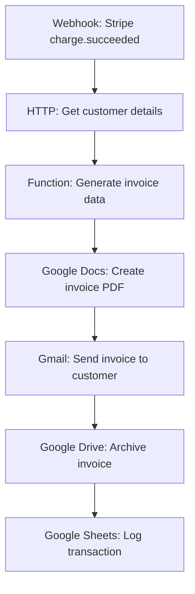
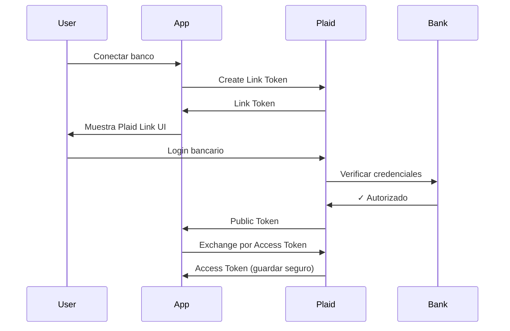
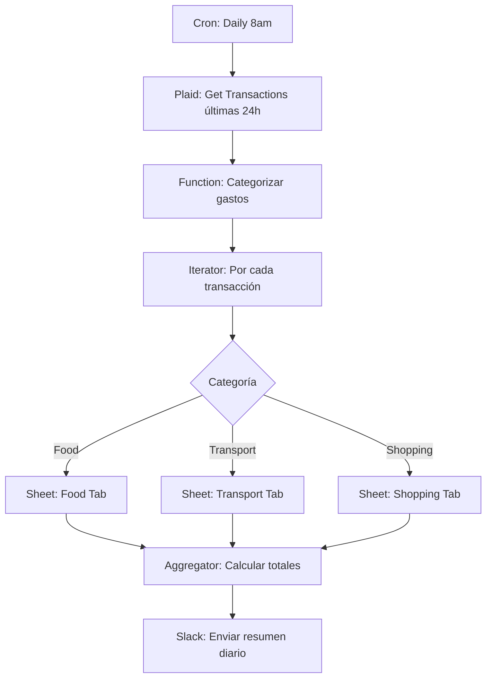
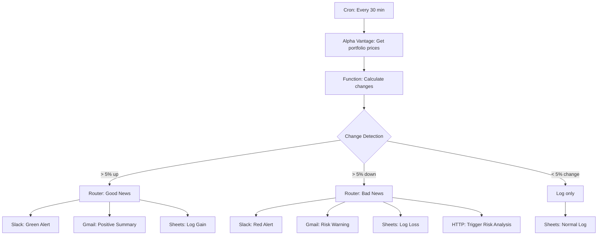

# Sesión 6: APIs Financieras Principales

## Objetivos de aprendizaje

- Integrar APIs de pagos (Stripe, PayPal)
- Conectar con APIs bancarias (Plaid, Yodlee)
- Obtener datos de mercado (Alpha Vantage, Yahoo Finance)
- Implementar workflows completos con múltiples APIs

## APIs de procesamiento de pagos

### Stripe API

**Propósito**: Procesamiento de pagos, suscripciones, facturación

#### Configuración Inicial

```bash
# Obtener API keys de https://dashboard.stripe.com/apikeys
# Test mode: sk_test_xxx
# Live mode: sk_live_xxx
```

#### Casos de Uso Comunes

##### 1. Crear Cliente

```javascript
// En n8n/Make/Zapier con HTTP Request
POST https://api.stripe.com/v1/customers
Headers:
  Authorization: Bearer sk_test_XXX
  Content-Type: application/x-www-form-urlencoded

Body (form-urlencoded):
email=customer@example.com
name=Juan Pérez
metadata[user_id]=123
```

**Respuesta**:
```json
{
  "id": "cus_xxxxx",
  "object": "customer",
  "email": "customer@example.com",
  "created": 1617123600
}
```

##### 2. Crear cargo (payment)

```javascript
POST https://api.stripe.com/v1/charges
Headers:
  Authorization: Bearer sk_test_XXX
Content-Type: application/x-www-form-urlencoded

Body:
amount=2000              // $20.00 (centavos)
currency=usd
source=tok_visa          // Token de tarjeta
customer=cus_xxxxx
description=Pago por servicio premium
```

##### 3. Listar transacciones

```javascript
GET https://api.stripe.com/v1/charges?limit=100&created[gte]=1617000000
Headers:
  Authorization: Bearer sk_test_XXX
```

##### 4. Webhooks de Stripe

```javascript
// Configurar webhook en: https://dashboard.stripe.com/webhooks
// Eventos importantes:
- charge.succeeded      // Pago exitoso
- charge.failed         // Pago falló
- customer.created      // Nuevo cliente
- invoice.payment_succeeded  // Pago de factura
- subscription.created  // Nueva suscripción

// Webhook payload example
{
  "id": "evt_xxxxx",
  "type": "charge.succeeded",
  "data": {
    "object": {
      "id": "ch_xxxxx",
      "amount": 2000,
      "currency": "usd",
      "customer": "cus_xxxxx"
    }
  }
}
```

#### Workflow: Auto-facturación



### PayPal API

**Propósito**: Pagos alternativos, marketplaces

#### Autenticación OAuth

```javascript
POST https://api.paypal.com/v1/oauth2/token
Headers:
  Authorization: Basic BASE64(client_id:secret)
  Content-Type: application/x-www-form-urlencoded

Body:
grant_type=client_credentials
```

**Respuesta**:
```json
{
  "access_token": "A21AAxxxxx",
  "token_type": "Bearer",
  "expires_in": 32400
}
```

#### Crear pago

```javascript
POST https://api.paypal.com/v2/checkout/orders
Headers:
  Authorization: Bearer A21AAxxxxx
  Content-Type: application/json

Body:
{
  "intent": "CAPTURE",
  "purchase_units": [{
    "amount": {
      "currency_code": "USD",
      "value": "100.00"
    }
  }]
}
```

## APIs bancarias

### Plaid API

**Propósito**: Conectar con cuentas bancarias, obtener transacciones

#### Flujo de Integración



#### 1. Create Link Token

```javascript
POST https://sandbox.plaid.com/link/token/create
Headers:
  Content-Type: application/json

Body:
{
  "client_id": "YOUR_CLIENT_ID",
  "secret": "YOUR_SECRET",
  "client_name": "Mi App Financiera",
  "user": {
    "client_user_id": "user_123"
  },
  "products": ["transactions"],
  "country_codes": ["US"],
  "language": "en"
}
```

#### 2. Exchange Token

```javascript
POST https://sandbox.plaid.com/item/public_token/exchange
Body:
{
  "client_id": "YOUR_CLIENT_ID",
  "secret": "YOUR_SECRET",
  "public_token": "public-sandbox-xxxxx"
}
```

**Respuesta**:
```json
{
  "access_token": "access-sandbox-xxxxx",
  "item_id": "item-xxxxx",
  "request_id": "req-xxxxx"
}
```

#### 3. Get Transactions

```javascript
POST https://sandbox.plaid.com/transactions/get
Body:
{
  "client_id": "YOUR_CLIENT_ID",
  "secret": "YOUR_SECRET",
  "access_token": "access-sandbox-xxxxx",
  "start_date": "2024-01-01",
  "end_date": "2024-03-27"
}
```

**Respuesta**:
```json
{
  "transactions": [
    {
      "transaction_id": "txn_1",
      "amount": 89.40,
      "date": "2024-03-26",
      "name": "Starbucks",
      "category": ["Food and Drink", "Restaurants", "Coffee Shop"],
      "pending": false
    }
  ],
  "total_transactions": 142
}
```

#### 4. Get Account Balance

```javascript
POST https://sandbox.plaid.com/accounts/balance/get
Body:
{
  "client_id": "YOUR_CLIENT_ID",
  "secret": "YOUR_SECRET",
  "access_token": "access-sandbox-xxxxx"
}
```

**Respuesta**:
```json
{
  "accounts": [
    {
      "account_id": "acc_1",
      "name": "Checking",
      "official_name": "Plaid Checking",
      "balances": {
        "available": 1234.56,
        "current": 1234.56,
        "iso_currency_code": "USD"
      },
      "type": "depository",
      "subtype": "checking"
    }
  ]
}
```

#### Workflow: Análisis de gastos automático



## APIs de datos de mercado

### Alpha Vantage

**Propósito**: Datos históricos de acciones, forex, crypto

#### Endpoints principales

##### 1. Time Series Daily

```javascript
GET https://www.alphavantage.co/query?function=TIME_SERIES_DAILY&symbol=AAPL&apikey=YOUR_KEY

Respuesta (simplificada):
{
  "Time Series (Daily)": {
    "2024-03-27": {
      "1. open": "172.50",
      "2. high": "174.30",
      "3. low": "171.80",
      "4. close": "173.50",
      "5. volume": "52834029"
    }
  }
}
```

##### 2. Global Quote (precio actual)

```javascript
GET https://www.alphavantage.co/query?function=GLOBAL_QUOTE&symbol=IBM&apikey=YOUR_KEY

{
  "Global Quote": {
    "01. symbol": "IBM",
    "05. price": "189.50",
    "09. change": "2.30",
    "10. change percent": "1.23%"
  }
}
```

##### 3. Currency Exchange

```javascript
GET https://www.alphavantage.co/query?function=CURRENCY_EXCHANGE_RATE&from_currency=USD&to_currency=EUR&apikey=YOUR_KEY

{
  "Realtime Currency Exchange Rate": {
    "1. From_Currency Code": "USD",
    "3. To_Currency Code": "EUR",
    "5. Exchange Rate": "0.92450",
    "6. Last Refreshed": "2024-03-27 15:30:00"
  }
}
```

##### 4. Technical Indicators

```javascript
GET https://www.alphavantage.co/query?function=RSI&symbol=AAPL&interval=daily&time_period=14&series_type=close&apikey=YOUR_KEY

{
  "Technical Analysis: RSI": {
    "2024-03-27": {
      "RSI": "65.2341"
    }
  }
}
```

###  Yahoo Finance (unofficial)

```javascript
// Get Stock Quote
GET https://query1.finance.yahoo.com/v8/finance/chart/AAPL?interval=1d

// Get Multiple Quotes
GET https://query1.finance.yahoo.com/v7/finance/quote?symbols=AAPL,GOOGL,MSFT
```

!!! warning "Yahoo Finance API"
    Yahoo no tiene API oficial pública, pero endpoints públicos usados por su web. Pueden cambiar sin aviso.

### CoinGecko (Cryptocurrency)

```javascript
// Get Bitcoin Price
GET https://api.coingecko.com/api/v3/simple/price?ids=bitcoin&vs_currencies=usd,eur

{
  "bitcoin": {
    "usd": 69420,
    "eur": 63980
  }
}

// Get Market Data
GET https://api.coingecko.com/api/v3/coins/bitcoin/market_chart?vs_currency=usd&days=30

{
  "prices": [
    [1617000000000, 58000],
    [1617086400000, 59200],
    ...
  ]
}
```

## Caso práctico integrado

### Sistema de alertas multicanal

**Objetivo**: Monitorear portfolio, detectar cambios significativos, alertar por múltiples canales

#### Arquitectura



#### Implementación en n8n

**Nodo 1: Cron Trigger**
```yaml
Mode: Every 30 minutes
During: Market Hours (9:30am - 4pm EST)
```

**Nodo 2: Get Portfolio Prices**
```javascript
// HTTP Request (multiple)
const symbols = ['AAPL', 'GOOGL', 'MSFT', 'AMZN', 'TSLA'];
const API_KEY = '{{ $env.ALPHA_VANTAGE_KEY }}';

const requests = symbols.map(symbol => ({
  url: `https://www.alphavantage.co/query?function=GLOBAL_QUOTE&symbol=${symbol}&apikey=${API_KEY}`,
  method: 'GET'
}));

// O usar Iterator para procesar uno por uno
```

**Nodo 3: Calculate Changes**
```javascript
// Function Node
const currentPrices = $input.all();
const previousPrices = $getWorkflowStaticData('node');

const changes = currentPrices.map(item => {
  const symbol = item.json['Global Quote']['01. symbol'];
  const currentPrice = parseFloat(item.json['Global Quote']['05. price']);
  const previousPrice = previousPrices[symbol] || currentPrice;
  
  const change = ((currentPrice - previousPrice) / previousPrice) * 100;
  
  // Guardar precio actual para siguiente ejecución
  previousPrices[symbol] = currentPrice;
  
  return {
    json: {
      symbol: symbol,
      current_price: currentPrice,
      previous_price: previousPrice,
      change_percent: change.toFixed(2),
      change_amount: (currentPrice - previousPrice).toFixed(2),
      timestamp: new Date().toISOString(),
      direction: change > 0 ? 'up' : 'down'
    }
  };
});

$setWorkflowStaticData('node', previousPrices);

return changes;
```

**Nodo 4: Filter Significant Changes**
```javascript
// IF Node
{{ Math.abs($json.change_percent) }} > 5
```

**Nodo 5: Slack Notification**
```javascript
// Slack Node
{
  "channel": "#portfolio-alerts",
  "text": "",
  "blocks": [
    {
      "type": "header",
      "text": {
        "type": "plain_text",
        "text": "{{ $json.direction === 'up' ? '📈' : '📉' }} {{ $json.symbol }} cambió {{ $json.change_percent }}%"
      }
    },
    {
      "type": "section",
      "fields": [
        {
          "type": "mrkdwn",
          "text": "*Precio Anterior:*\n${{ $json.previous_price }}"
        },
        {
          "type": "mrkdwn",
          "text": "*Precio Actual:*\n${{ $json.current_price }}"
        },
        {
          "type": "mrkdwn",
          "text": "*Cambio:*\n{{ $json.direction === 'up' ? '+' : '' }}${{ $json.change_amount }} ({{ $json.change_percent }}%)"
        },
        {
          "type": "mrkdwn",
          "text": "*Timestamp:*\n{{ $json.timestamp }}"
        }
      ]
    },
    {
      "type": "actions",
      "elements": [
        {
          "type": "button",
          "text": {
            "type": "plain_text",
            "text": "View Chart"
          },
          "url": "https://finance.yahoo.com/quote/{{ $json.symbol }}"
        }
      ]
    }
  ]
}
```

## Rate limits y mejores prácticas

### Límites por API

| API | Rate Limit | Recomendación |
|-----|------------|---------------|
| **Stripe** | 100 req/sec (test), más en producción | No suele ser problema |
| **Plaid** | Según plan, típicamente ilimitado sandbox | Usar webhooks en producción |
| **Alpha Vantage** | 5 req/min (free), 75/min (premium) | Cachear datos, agregar delays |
| **CoinGecko** | 10-50 req/min según tier | Implementar exponential backoff |

### Estrategias de optimización

```javascript
// 1. Batch requests cuando sea posible
// En lugar de:
for (symbol in ['AAPL', 'GOOGL', 'MSFT']) {
  await getPrice(symbol);  // 3 requests
}

// Hacer:
await getPrices(['AAPL', 'GOOGL', 'MSFT']);  // 1 request

// 2. Caché con expira ción
const CACHE_DURATION = 5 * 60 * 1000; // 5 minutos
const cache = {};

function getCachedPrice(symbol) {
  if (cache[symbol] && Date.now() - cache[symbol].timestamp < CACHE_DURATION) {
    return cache[symbol].price;
  }
  
  const price = await fetchPriceFromAPI(symbol);
  cache[symbol] = { price, timestamp: Date.now() };
  return price;
}

// 3. Exponential backoff en reintentos
async function fetchWithRetry(url, maxRetries = 3) {
  for (let i = 0; i < maxRetries; i++) {
    try {
      return await fetch(url);
    } catch (error) {
      if (i === maxRetries - 1) throw error;
      const delay = Math.pow(2, i) * 1000;  // 1s, 2s, 4s
      await sleep(delay);
    }
  }
}
```

## Ejercicio práctico

### Tarea: Dashboard Financiero Automatizado

**Objetivo**: Crear workflow que actualice dashboard con datos de múltiples fuentes

**Requisitos**:

1. **Datos a recopilar** (cada hora durante horario de mercado):
   - Precios de 5 acciones (Alpha Vantage)
   - Saldo de cuenta bancaria (Plaid sandbox)
   - Tipo de cambio USD/EUR (Alpha Vantage)
   - Precio Bitcoin (CoinGecko)

2. **Procesamiento**:
   - Calcular valor total del portfolio
   - Detectar cambios > 2%
   - Calcular diversificación

3. **Output**:
   - Actualizar Google Sheet con timestamp
   - Si cambio significativo → Slack notification
   - Gráfico diario agregado

**Entregable**: 
- Workflow exportado (JSON)
- Screenshot de Google Sheet actualizado
- Ejemplo de notificación Slack

## Recursos

### Documentación Oficial

- [Stripe API Docs](https://stripe.com/docs/api)
- [Plaid API Docs](https://plaid.com/docs/)
- [Alpha Vantage Docs](https://www.alphavantage.co/documentation/)
- [CoinGecko API](https://www.coingecko.com/en/api)

### Sandboxes y testing

- Stripe Test Mode
- Plaid Sandbox
- Alpha Vantage Free Tier

## Resumen

✅ APIs de pagos (Stripe, PayPal)  
✅ APIs bancarias (Plaid)  
✅ APIs de datos de mercado (Alpha Vantage, CoinGecko)  
✅ Integración multicanal  
✅ Rate limiting y optimización  

**Próxima sesión**: **Autenticación y Seguridad en APIs** - OAuth, JWT, mejores prácticas.

---

!!! tip "Tarea para Próxima Sesión"
    1. Completa ejercicio del dashboard
    2. Crea cuentas de desarrollador en todas las APIs mencionadas
    3. Lee sobre OAuth 2.0
    4. Investiga sobre almacenamiento seguro de credenciales
