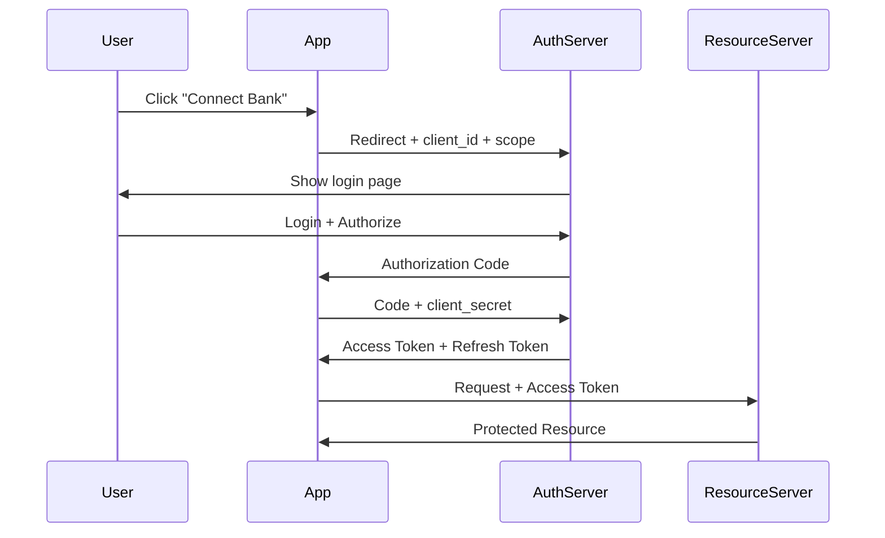
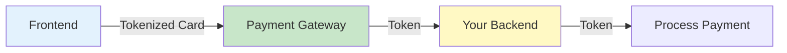
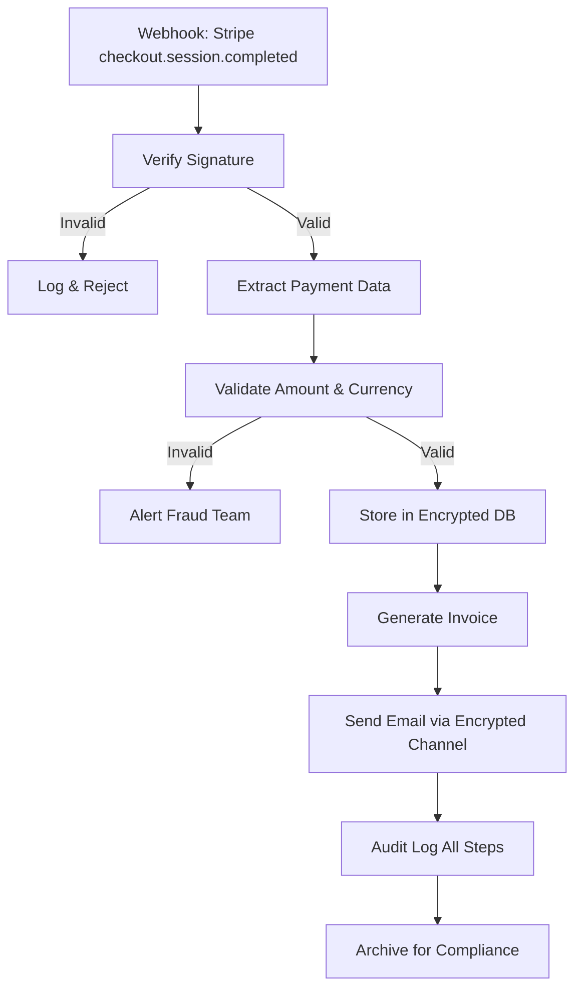

# Sesión 7: Autenticación y Seguridad en APIs

## Objetivos de aprendizaje

- Implementar OAuth 2.0 en workflows
- Manejar JWT tokens de forma segura
- Aplicar mejores prácticas de seguridad
- Cumplir con regulaciones financieras (PCI-DSS, GDPR)

## Métodos de Autenticación

### Comparativa de métodos

| Método | Seguridad | Complejidad | Caso de Uso |
|--------|-----------|-------------|-------------|
| **API Key** | ⭐⭐ | Baja | APIs internas, desarrollo |
| **Bearer Token** | ⭐⭐⭐ | Media | APIs públicas |
| **OAuth 2.0** | ⭐⭐⭐⭐ | Alta | Acceso delegado |
| **JWT** | ⭐⭐⭐⭐ | Media-Alta | Microservicios, SPAs |
| **mTLS** | ⭐⭐⭐⭐⭐ | Muy Alta | Banking APIs, B2B |

##Sesión OAuth 2.0 en Detalle

### Flujos de OAuth 2.0

#### 1. Authorization Code Flow (Más Seguro)



**Implementación**:

```javascript
// Paso 1: Redirect a authorization server
const authUrl = `https://auth.example.com/oauth/authorize?
  response_type=code&
  client_id=${CLIENT_ID}&
  redirect_uri=${encodeURIComponent(REDIRECT_URI)}&
  scope=read:transactions write:transfers&
  state=${generateRandomState()}`;

window.location.href = authUrl;

// Paso 2: Recibir code en callback
// https://yourapp.com/callback?code=ABC123&state=XYZ

// Paso 3: Exchange code por access token
const response = await fetch('https://auth.example.com/oauth/token', {
  method: 'POST',
  headers: {
    'Content-Type': 'application/x-www-form-urlencoded',
  },
  body: new URLSearchParams({
    grant_type: 'authorization_code',
    code: authorizationCode,
    redirect_uri: REDIRECT_URI,
    client_id: CLIENT_ID,
    client_secret: CLIENT_SECRET
  })
});

const { access_token, refresh_token, expires_in } = await response.json();

// Guardar tokens de forma segura (cifrados)
await secureStorage.set('access_token', access_token);
await secureStorage.set('refresh_token', refresh_token);
```

#### 2. Refresh Token Flow

```javascript
// Cuando access token expira
async function refreshAccessToken(refreshToken) {
  const response = await fetch('https://auth.example.com/oauth/token', {
    method: 'POST',
    headers: {
      'Content-Type': 'application/x-www-form-urlencoded',
    },
    body: new URLSearchParams({
      grant_type: 'refresh_token',
      refresh_token: refreshToken,
      client_id: CLIENT_ID,
      client_secret: CLIENT_SECRET
    })
  });
  
  const { access_token, refresh_token: newRefreshToken } = await response.json();
  
  // Actualizar tokens almacenados
  await secureStorage.set('access_token', access_token);
  await secureStorage.set('refresh_token', newRefreshToken);
  
  return access_token;
}

// Middleware para manejo automático
async function apiCall(url, options = {}) {
  let accessToken = await secureStorage.get('access_token');
  
  try {
    const response = await fetch(url, {
      ...options,
      headers: {
        ...options.headers,
        'Authorization': `Bearer ${accessToken}`
      }
    });
    
    if (response.status === 401) {
      // Token expirado, refresh
      const refreshToken = await secureStorage.get('refresh_token');
      accessToken = await refreshAccessToken(refreshToken);
      
      // Reintentar request con nuevo token
      return fetch(url, {
        ...options,
        headers: {
          ...options.headers,
          'Authorization': `Bearer ${accessToken}`
        }
      });
    }
    
    return response;
  } catch (error) {
    console.error('API call failed:', error);
    throw error;
  }
}
```

## JWT (JSON Web Tokens)

### Estructura de JWT

```
eyJhbGciOiJIUzI1NiIsInR5cCI6IkpXVCJ9.
eyJzdWIiOiIxMjM0NTY3ODkwIiwibmFtZSI6IkpvaG4gRG9lIiwiaWF0IjoxNTE2MjM5MDIyfQ.
SflKxwRJSMeKKF2QT4fwpMeJf36POk6yJV_adQssw5c
```

**Decodificado**:

```json
// Header
{
  "alg": "HS256",
  "typ": "JWT"
}

// Payload
{
  "sub": "1234567890",
  "name": "John Doe",
  "iat": 1516239022,
  "exp": 1516242622,
  "scope": ["read:transactions", "write:transfers"],
  "customer_id": "cust_abc123"
}

// Signature (no se puede ver, se verifica)
```

### Validación de JWT

```javascript
// En n8n Function Node o backend
const jwt = require('jsonwebtoken');

function validateJWT(token, secret) {
  try {
    const decoded = jwt.verify(token, secret);
    
    // Verificaciones adicionales
    if (decoded.exp < Date.now() / 1000) {
      throw new Error('Token expired');
    }
    
    if (!decoded.scope.includes('read:transactions')) {
      throw new Error('Insufficient permissions');
    }
    
    return decoded;
  } catch (error) {
    console.error('JWT validation failed:', error);
    return null;
  }
}

// Uso en workflow
const authHeader = $node["Webhook"].json.headers.authorization;
const token = authHeader.replace('Bearer ', '');
const decoded = validateJWT(token, process.env.JWT_SECRET);

if (!decoded) {
  return [{
    json: { error: 'Unauthorized' },
    statusCode: 401
  }];
}
```

## Almacenamiento seguro de credenciales

### En plataformas de automatización

#### n8n Credentials

```javascript
// Definir credencial
{
  "name": "Stripe API",
  "type": "stripeApi",
  "data": {
    "apiKey": "sk_live_XXX"  // Cifrado en DB
  }
}

// Usar en workflow
// Nodo HTTP Request selecciona credencial "Stripe API"
// n8n inyecta automáticamente en header Authorization
```

#### Make/Zapier Connections

```
- Guardar credenciales por app
- Automáticamente incluidas en requests
- Re-autenticación automática si expiran
- No expuestas en logs
```

### Variables de entorno

```bash
# .env file (NUNCA en repositorio)
STRIPE_API_KEY=sk_live_XXX
PLAID_CLIENT_ID=abc123
PLAID_SECRET=xyz789
JWT_SECRET=super-secret-key-change-in-production

# Docker deployment
docker run -e STRIPE_API_KEY="${STRIPE_API_KEY}" n8n

# Node.js access
const apiKey = process.env.STRIPE_API_KEY;
```

### Secretos en cloud

```bash
# AWS Secrets Manager
aws secretsmanager create-secret \
  --name prod/stripe/api-key \
  --secret-string "sk_live_XXX"

# Retrieve in code
const AWS = require('aws-sdk');
const client = new AWS.SecretsManager({region: 'us-east-1'});

const secret = await client.getSecretValue({
  SecretId: 'prod/stripe/api-key'
}).promise();

const apiKey = secret.SecretString;
```

## Mejores prácticas de seguridad

### 1. Principio de Mínimo Privilegio

```javascript
// ❌ MAL: Permisos amplios
{
  "scope": ["admin", "full_access"]
}

// ✅ BIEN: Solo permisos necesarios
{
  "scope": ["read:transactions", "write:transfers:under_1000"]
}
```

### 2. Rate Limiting

```javascript
// Implementar en API endpoint
const rateLimit = require('express-rate-limit');

const limiter = rateLimit({
  windowMs: 15 * 60 * 1000, // 15 minutos
  max: 100, // 100 requests por ventana
  message: 'Too many requests from this IP',
  standardHeaders: true,
  legacyHeaders: false,
});

app.use('/api/', limiter);
```

### 3. Validación de inputs

```javascript
// Sanitizar y validar
function validateTransferRequest(data) {
  // Whitelist de campos permitidos
  const allowedFields = ['from_account', 'to_account', 'amount', 'currency'];
  const cleanData = {};
  
  allowedFields.forEach(field => {
    if (data.hasOwnProperty(field)) {
      cleanData[field] = data[field];
    }
  });
  
  // Validar tipos y rangos
  if (typeof cleanData.amount !== 'number' || cleanData.amount <= 0) {
    throw new Error('Invalid amount');
  }
  
  if (cleanData.amount > 10000) {
    throw new Error('Amount exceeds daily limit');
  }
  
  // Sanitizar strings (prevenir SQL injection)
  if (cleanData.currency) {
    cleanData.currency = cleanData.currency.replace(/[^A-Z]/g, '').toUpperCase();
  }
  
  return cleanData;
}
```

### 4. HTTPS Obligatorio

```javascript
// Forzar HTTPS
app.use((req, res, next) => {
  if (req.header('x-forwarded-proto') !== 'https') {
    res.redirect(`https://${req.header('host')}${req.url}`);
  } else {
    next();
  }
});
```

### 5. Webhook signature verification

```javascript
// Verificar webhooks de Stripe
const stripe = require('stripe')(process.env.STRIPE_SECRET_KEY);

app.post('/webhook', express.raw({type: 'application/json'}), (req, res) => {
  const sig = req.headers['stripe-signature'];
  const endpointSecret = process.env.STRIPE_WEBHOOK_SECRET;
  
  let event;
  
  try {
    event = stripe.webhooks.constructEvent(req.body, sig, endpointSecret);
  } catch (err) {
    console.log(`Webhook signature verification failed.`, err.message);
    return res.sendStatus(400);
  }
  
  // Procesar evento verificado
  handleStripeEvent(event);
  
  res.json({received: true});
});
```

## Cumplimiento regulatorio

### PCI-DSS (Payment Card Industry Data Security Standard)

#### Requisitos Clave

!!! warning "Nunca almacenar"
    - Número completo de tarjeta (solo últimos 4 dígitos)
    - CVV/CVC
    - Datos de banda magnética

#### Workflow compliant



**Correcto**: Usar tokenización (Stripe Elements, PayPal SDK)

```javascript
// Frontend usa Stripe.js (PCI compliant)
const {token} = await stripe.createToken(card);

// Backend solo maneja token, no card data
fetch('/api/charge', {
  method: 'POST',
  body: JSON.stringify({ token: token.id, amount: 5000 })
});
```

### GDPR (General Data Protection Regulation)

#### Implementación de Derechos

```javascript
// Right to Access (Article 15)
app.get('/api/user/:id/data', authenticate, async (req, res) => {
  const userData = await db.getAllUserData(req.params.id);
  res.json({
    personal_data: userData,
    processing_purposes: ['Payment processing', 'Fraud prevention'],
    data_retention: '7 years (legal requirement)'
  });
});

// Right to Erasure (Article 17)
app.delete('/api/user/:id', authenticate, async (req, res) => {
  // Anonymize instead of delete if legal retention required
  await db.anonymizeUser(req.params.id);
  await db.deleteNonRequiredData(req.params.id);
  
  res.json({ message: 'Account deleted/anonymized' });
});

// Right to Data Portability (Article 20)
app.get('/api/user/:id/export', authenticate, async (req, res) => {
  const data = await db.getAllUserData(req.params.id);
  const exportedData = formatAsJSON(data);  // Machine-readable format
  
  res.setHeader('Content-Disposition', 'attachment; filename=my-data.json');
  res.json(exportedData);
});
```

### Logging y auditoría

```javascript
// Comprehensive audit logging
function auditLog(action, userId, details) {
  db.logs.insert({
    timestamp: new Date(),
    action: action,
    user_id: userId,
    ip_address: req.ip,
    user_agent: req.get('user-agent'),
    details: details,
    result: 'success' // or 'failure'
  });
}

// Usage
app.post('/api/transfers', async (req, res) => {
  const transfer = validateTransferRequest(req.body);
  
  auditLog('transfer_initiated', req.user.id, {
    from: transfer.from_account,
    to: transfer.to_account,
    amount: transfer.amount
  });
  
  try {
    const result = await executeTransfer(transfer);
    
    auditLog('transfer_completed', req.user.id, {
      transfer_id: result.id
    });
    
    res.json(result);
  } catch (error) {
    auditLog('transfer_failed', req.user.id, {
      error: error.message
    });
    throw error;
  }
});
```

## Caso práctico: secure payment workflow



## Ejercicio práctico

### Tarea: Implementar OAuth Flow Completo

**Objetivo**: Crear workflow que conecte con API usando OAuth 2.0

**Pasos**:

1. Registrar app en Google Cloud Console
2. Configurar OAuth consent screen
3. Crear workflow que:
   - Inicie authorization flow
   - Reciba callback con code
   - Exchange por access token
   - Use token para obtener eventos de Google Calendar
   - Refresh token automáticamente cuando expire

**Entregable**: Workflow funcional + documento de seguridad explicando medidas tomadas

## Recursos

- [OAuth 2.0 Simplified](https://www.oauth.com/)
- [JWT.io](https://jwt.io/)
- [PCI DSS Quick Reference Guide](https://www.pcisecuritystandards.org/)
- [GDPR Developer Guide](https://gdpr.eu/developers/)

## Resumen

✅ OAuth 2.0 implementation  
✅ JWT validation y manejo  
✅ Almacenamiento seguro de credenciales  
✅ PCI-DSS y GDPR compliance  
✅ Security best practices  

**Próxima sesión**: **Arquitectura de Workflows** - Diseño de workflows escalables y mantenibles.

---

!!! tip "Tarea para Próxima Sesión"
    1. Completa ejercicio OAuth
    2. Lee sobre patrones de diseño en workflows
    3. Revisa conceptos de error handling
    4. Piensa en un workflow complejo que necesites diseñar
