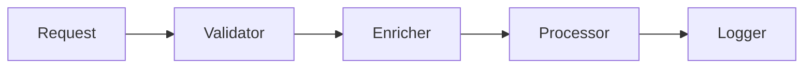
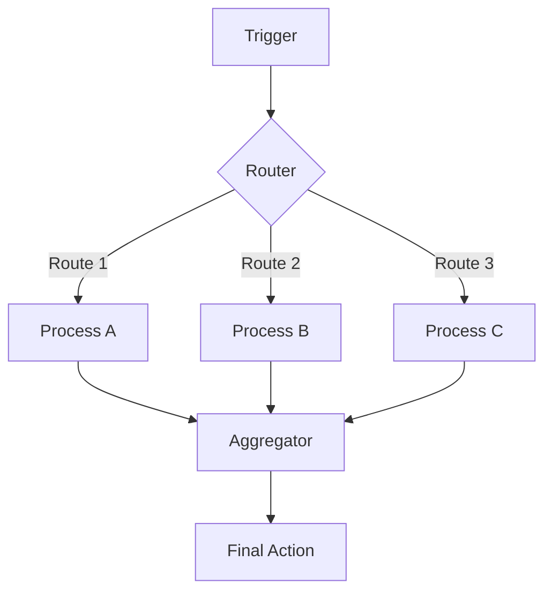
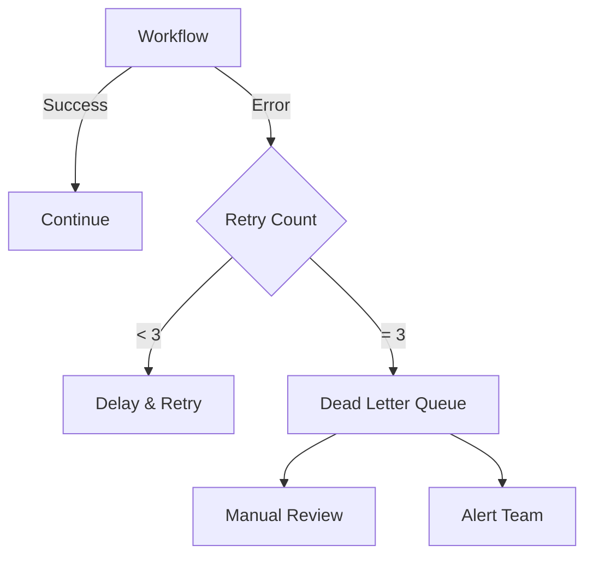

# Sesión 8: Arquitectura de Workflows

## Objetivos

- Diseñar workflows escalables y mantenibles
- Aplicar patrones de diseño
- Implementar error handling robusto
- Optimizar performance

## Patrones de diseño

### 1. Chain of Responsibility



### 2. Fan-Out / Fan-In



### 3. Circuit Breaker

```javascript
const CircuitBreaker = {
  failures: 0,
  threshold: 5,
  timeout: 60000, // 1 min
  state: 'CLOSED', // CLOSED, OPEN, HALF_OPEN
  
  async call(fn) {
    if (this.state === 'OPEN') {
      if (Date.now() - this.lastFailTime > this.timeout) {
        this.state = 'HALF_OPEN';
      } else {
        throw new Error('Circuit breaker is OPEN');
      }
    }
    
    try {
      const result = await fn();
      if (this.state === 'HALF_OPEN') {
        this.state = 'CLOSED';
        this.failures = 0;
      }
      return result;
    } catch (error) {
      this.failures++;
      this.lastFailTime = Date.now();
      
      if (this.failures >= this.threshold) {
        this.state = 'OPEN';
      }
      throw error;
    }
  }
};
```

## Error handling

### Estrategias de retry

```javascript
async function retryWithBackoff(fn, maxRetries = 3) {
  for (let i = 0; i < maxRetries; i++) {
    try {
      return await fn();
    } catch (error) {
      if (i === maxRetries - 1) throw error;
      
      const delay = Math.min(1000 * Math.pow(2, i), 30000);
      console.log(`Retry ${i + 1}/${maxRetries} in ${delay}ms`);
      await sleep(delay);
    }
  }
}
```

### Dead letter queue



## Optimización

### Paralelización

```javascript
// ❌ Secuencial (lento)
const prices = [];
for (const symbol of ['AAPL', 'GOOGL', 'MSFT']) {
  prices.push(await getPrice(symbol));
}

// ✅ Paralelo (rápido)
const prices = await Promise.all([
  getPrice('AAPL'),
  getPrice('GOOGL'),
  getPrice('MSFT')
]);
```

### Caching

```javascript
const NodeCache = require('node-cache');
const cache = new NodeCache({ stdTTL: 300 }); // 5 min

async function getCachedPrice(symbol) {
  const cached = cache.get(symbol);
  if (cached) return cached;
  
  const price = await fetchPrice(symbol);
  cache.set(symbol, price);
  return price;
}
```

## Monitoreo y observabilidad

### Métricas Clave

| Métrica | Objetivo | Alertar si |
|---------|----------|------------|
| **Success Rate** | > 99% | < 95% |
| **Execution Time** | < 5s | > 30s |
| **Error Rate** | < 1% | > 5% |
| **Queue Length** | < 100 | > 1000 |

### Logging estructurado

```javascript
const log = {
  info: (message, context) => {
    console.log(JSON.stringify({
      level: 'info',
      timestamp: new Date().toISOString(),
      message,
      ...context
    }));
  },
  
  error: (message, error, context) => {
    console.error(JSON.stringify({
      level: 'error',
      timestamp: new Date().toISOString(),
      message,
      error: error.message,
      stack: error.stack,
      ...context
    }));
  }
};

// Uso
log.info('Transfer initiated', {
  transfer_id: 'tx_123',
  amount: 1000,
  from: 'ACC_1',
  to: 'ACC_2'
});
```

## Ejercicio

**Diseñar**: Workflow de procesamiento de facturas con:
- Circuit breaker para API externa
- Retry con exponential backoff
- Dead letter queue
- Métricas de monitoring

## Recursos

- [Enterprise Integration Patterns](https://www.enterpriseintegrationpatterns.com/)
- [Workflow Patterns](http://www.workflowpatterns.com/)

## Resumen

✅ Patrones de diseño aplicados  
✅ Error handling robusto  
✅ Optimización de performance  
✅ Monitoreo y observabilidad  

**Próxima sesión**: Workflows Financieros Avanzados
