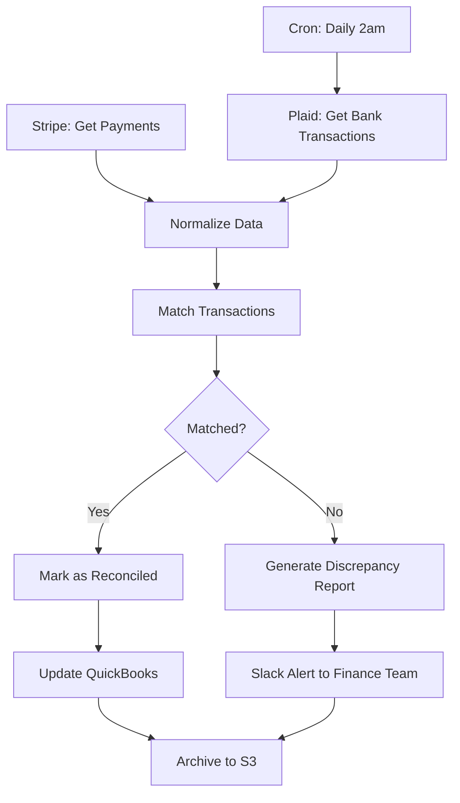
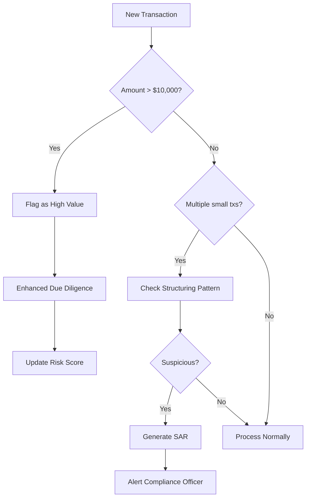
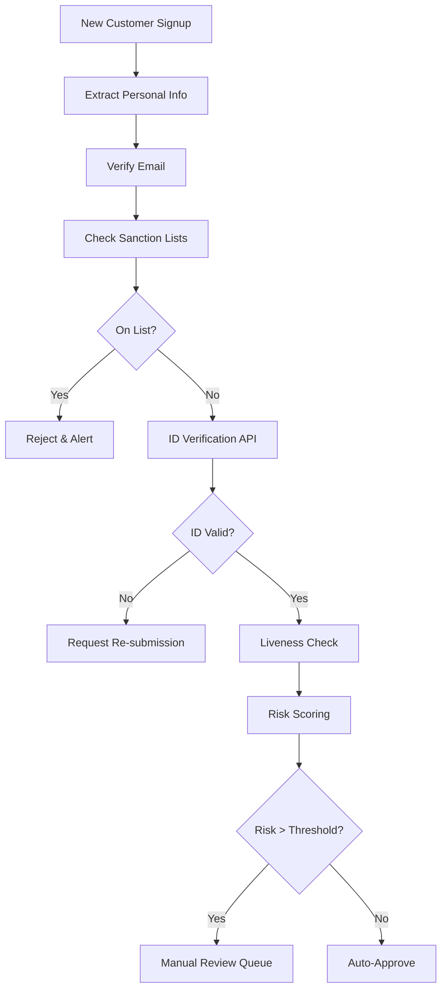
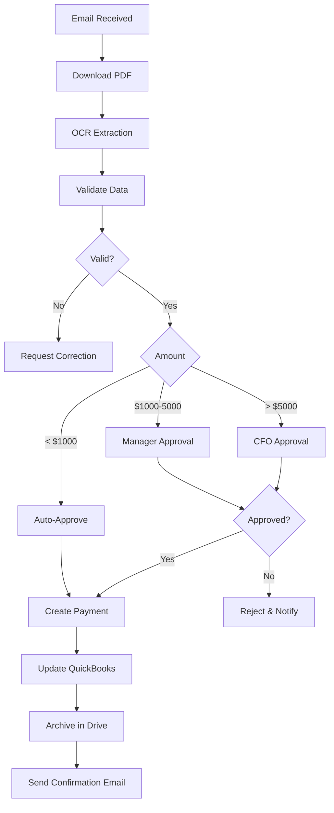

# Sesión 9: Workflows Financieros Avanzados

## Objetivos

- Implementar workflows complejos end-to-end
- Integrar múltiples sistemas
- Manejar conciliación automática
- Automatizar compliance y reportes

## Caso 1: Conciliación bancaria automatizada

### Arquitectura



### Lógica de matching

```javascript
function matchTransactions(bankTx, stripeTx) {
  const matches = [];
  const unmatched = [];
  
  bankTx.forEach(bt => {
    const match = stripeTx.find(st => 
      Math.abs(st.amount - bt.amount) < 0.01 &&
      Math.abs(new Date(st.date) - new Date(bt.date)) < 2 * 24 * 60 * 60 * 1000 // 2 days
    );
    
    if (match) {
      matches.push({ bank: bt, stripe: match, status: 'matched' });
    } else {
      unmatched.push({ bank: bt, status: 'unmatched' });
    }
  });
  
  return { matches, unmatched };
}
```

## Caso 2: sistema anti-lavado de dinero (AML)

### Detección de patrones sospechosos



### Implementación

```javascript
// Detectar structuring (smurfing)
function detectStructuring(transactions, customerId, days = 7) {
  const recent = transactions.filter(tx =>
    tx.customer_id === customerId &&
    tx.date > Date.now() - days * 24 * 60 * 60 * 1000
  );
  
  const totalAmount = recent.reduce((sum, tx) => sum + tx.amount, 0);
  const avgAmount = totalAmount / recent.length;
  
  // Red flags
  const multipleJustBelow10k = recent.filter(tx => 
    tx.amount > 9000 && tx.amount < 10000
  ).length;
  
  const frequentSmallDeposits = recent.length > 20 && avgAmount < 500;
  
  if (multipleJustBelow10k > 2 || frequentSmallDeposits) {
    return {
      suspicious: true,
      reason: multipleJustBelow10k > 2 ? 'Multiple transactions just below $10k' : 'Unusual frequency of small deposits',
      transaction_count: recent.length,
      total_amount: totalAmount,
      risk_score: 85
    };
  }
  
  return { suspicious: false, risk_score: 20 };
}
```

## Caso 3: trading algorítmico básico

### Estrategia simple: media móvil

```javascript
// Calculate Moving Average
function calculateMA(prices, period) {
  const sum = prices.slice(-period).reduce((a, b) => a + b, 0);
  return sum / period;
}

// Trading signal
function generateSignal(currentPrice, prices) {
  const ma50 = calculateMA(prices, 50);
  const ma200 = calculateMA(prices, 200);
  
  if (ma50 > ma200 && currentPrice > ma50) {
    return 'BUY';
  } else if (ma50 < ma200 && currentPrice < ma50) {
    return 'SELL';
  }
  
  return 'HOLD';
}

// Workflow implementation
const prices = await getHistoricalPrices('AAPL', 200);
const signal = generateSignal(prices[prices.length - 1], prices);

if (signal === 'BUY') {
  await executeTrade({
    symbol: 'AAPL',
    side: 'buy',
    quantity: 10,
    type: 'market'
  });
  
  await sendSlackNotification(`🟢 BUY signal for AAPL at $${prices[prices.length - 1]}`);
}
```

## Caso 4: reporte regulatorio automatizado

### FINRA trade reporting

```javascript
// Generar reporte diario
async function generateFINRAReport(date) {
  const trades = await db.getTrades({ date });
  
  const report = {
    report_date: date,
    firm_id: 'FIRM123',
    trades: trades.map(t => ({
      symbol: t.symbol,
      quantity: t.quantity,
      price: t.price,
      time: t.executed_at,
      side: t.side,
      capacity: 'principal', // or 'agent'
      clearing_number: t.clearing_num
    }))
  };
  
  // Generate XML según FINRA spec
  const xml = generateFINRAXML(report);
  
  // Submit via SFTP
  await submitToFINRA(xml);
  
  // Archive
  await s3.upload({
    Bucket: 'compliance-reports',
    Key: `finra/${date}.xml`,
    Body: xml
  });
  
  return report;
}
```

## Caso 5: KYC automatizado



### Integración con APIs de verificación

```javascript
// Verificar contra listas de sanciones
async function checkSanctions(name, country) {
  const response = await fetch('https://api.complyadvantage.com/searches', {
    method: 'POST',
    headers: {
      'Authorization': `Bearer ${process.env.COMPLY_ADVANTAGE_KEY}`,
      'Content-Type': 'application/json'
    },
    body: JSON.stringify({
      search_term: name,
      fuzziness: 0.6,
      filters: {
        types: ['sanction', 'warning', 'fitness-probity']
      }
    })
  });
  
  const data = await response.json();
  
  return {
    is_sanctioned: data.data.total_hits > 0,
    matches: data.data.hits
  };
}

// Verificación de identidad
async function verifyID(documentImage, selfie) {
  const response = await fetch('https://api.onfido.com/v3/checks', {
    method: 'POST',
    headers: {
      'Authorization': `Token token=${process.env.ONFIDO_KEY}`,
      'Content-Type': 'application/json'
    },
    body: JSON.stringify({
      applicant_id: applicantId,
      report_names: ['document', 'facial_similarity_photo']
    })
  });
  
  return response.json();
}
```

## Ejercicio práctico

### Construir: Sistema completo de gestión de facturas

**Requisitos**:

1. **Recepción**: Email con PDF adjunto
2. **Extracción**: OCR para extraer datos
3. **Validación**: Verificar contra PO
4. **Aprobación**: Workflow de aprobación según monto
5. **Pago**: Crear transferencia si aprobado
6. **Archivo**: Guardar en sistema documental
7. **Contabilidad**: Registrar en QuickBooks

**Flujo Completo**:



## Recursos

- [Financial Workflows Library](https://github.com/financial-automation)
- [AML Pattern Detection](https://www.acams.org/)
- [RegTech Solutions](https://www.regtech.org/)

## Resumen

✅ Conciliación bancaria automatizada  
✅ Detección de lavado de dinero  
✅ Trading algorítmico básico  
✅ Reportes regulatorios  
✅ KYC automatizado  

**Próxima sesión**: Automatización de Reportes
